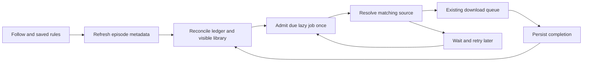

# Automatic downloads for followed series

Status: proposal, not implemented. Research date: 2026-10-03.

## Recommendation

Build a small owner-bound subscription service above the existing lazy download
queue. Refresh episode metadata separately from looking for a usable source.
Persist episode decisions independently of queue history. Start with future
episodes over HTTP, explicit language/subtitle rules and a pinned destination.
Raw torrent automation should follow only after the lazy resolver supports it.

This is a medium-sized feature involving persistence, queue semantics and account
isolation, rather than a timer around the bulk-download endpoint.

## Inspiration and alternatives

| Project | Relevant approach | Application here |
| --- | --- | --- |
| [Sonarr](https://wiki.servarr.com/sonarr/faq) | Separates monitoring incoming releases from explicit searches for missing episodes. | Separate following future episodes from backfilling old ones; avoid repeatedly searching the entire series. |
| [FlexGet timeframe](https://flexget.com/Plugins/series/timeframe) | Waits for a desired quality before accepting an alternative after a configured period. | A later language grace period could wait for Czech audio before accepting another language. This is an adaptation, not an existing FlexGet language feature. |
| [Medusa](https://github.com/pymedusa/Medusa) | Separates metadata, provider search, download clients and library organization. | Keep subscription scheduling separate from source resolution and file transfer. |

Sonarr's RSS model should not be copied literally: the current Stremio integration
asks for streams of a specific video and has no release-feed integration. We need
bounded polling of due episodes, not an assumption that an addon emits new-release
events. The [Stremio metadata contract](https://github.com/Stremio/stremio-addon-sdk/blob/master/docs/api/responses/meta.md)
provides video IDs and release dates, with season/episode numbers when applicable.
An air date is scheduling information, not proof that a usable source exists.

An external Sonarr installation remains an option for users who already operate
indexers and download clients. It would add a separate management stack and would
not directly reuse our addon source selection or account permissions. A cron job
calling the bulk endpoint is a useful disposable prototype, but is not a reliable
product feature: it lacks durable decisions, recovery and user-facing state.

## Existing code and actual gaps

Verified against origin/main at `8f09b4c4`; recheck symbols before implementation.

- `server/src/routes/downloads.ts::registerDownloadRoutes` validates bulk source,
  audio and subtitle choices, snapshots destination settings and creates lazy jobs.
  Extract this validation into a shared service instead of calling an HTTP route
  or duplicating its rules in a scheduler. Its current `titleLanguage` lookup omits
  the viewer, so grant-scoped metadata access must be part of the extraction itself.
- `server/src/downloads.ts::DownloadSelection` already stores addon order, source
  strategy, audio modes, fallback languages, subtitles and destination settings.
  It has no resolution/codec/bitrate quality profile. Largest file is not a
  reliable substitute for quality, especially for unattended downloads.
- `DownloadQueue.addPending(title, source, media?, ownerUserId?)` checks only for
  active jobs sharing `videoId`. It ignores completed/failed jobs and does not
  scope this check by owner, media type or destination. It does not prove that an
  episode is already on disk. Reusing it unchanged would permit repeated downloads
  after completion and wrongly suppress some independent users' requests.
- `server/src/index.ts::queue.setResolver` filters candidates to `stream.url`;
  `DownloadQueue.resolve` requires a URL. Manual `add` can enter `addDebrid`, but
  lazy raw-torrent resolution is not implemented. An addon returning a ready
  debrid HTTP URL already works; a raw infoHash is a different path.
- `ownerMayDownload`, owner-aware stream resolution and permission pauses provide
  useful enforcement. New background metadata calls must explicitly pass a viewer;
  `cachedMeta` without one can consult all addons. Its current cache lasts six hours.
  On current main, supplying a viewer also enables interactive outbound retries;
  separate authorization scope from interactive priority before using it on a timer.
- `MetaItem.videos` is `Array<Record<string, unknown>>`; introduce a validated
  episode representation, including the existing `episode ?? number` compatibility
  convention where unambiguous. `metadata` fills missing fields rather than merging
  episode lists from every provider, so choose and retain metadata provenance.
- Library parsing and metadata bindings can help identify existing episodes, but
  `episodes.json` is metadata, not an authoritative inventory of downloaded files.
- `LibraryAutoScan` demonstrates bounded background lifecycle management; it is
  not a series subscription scheduler. Existing favourites/watch lists should not
  acquire download side effects. Following is a separate explicit action.

## User behavior for the first release

On a series detail, offer an action to automatically download new episodes. Its
form reuses the bulk selection controls and adds the start boundary and destination.
All interface strings must be catalogue keys in both English and Czech. Reuse
`SeriesDownloadDialog`, `SaveTargetDialog` and the documented UI conventions
rather than introducing a separate form system.

Default to episodes released after activation; include later seasons, exclude
specials, and never download the entire historical catalogue on activation.
Offer an explicit starting episode as an alternative, with a preview of the
currently eligible missing episodes before saving. A future follow can be saved
before any episode airs. If initial metadata cannot be read, keep setup pending
and do not silently establish an empty baseline.

Store the activation instant and the initial episode snapshot. Every refresh
re-evaluates all known IDs against the start boundary, including IDs discovered
late. A valid release date before activation remains historical even if newly
added to the provider. Future-dated episodes wait. Invalid or absent dates require
attention and do not trigger an automatic download in the default mode. Date-only
values use a documented conservative end-of-day UTC boundary. An explicit starting
episode can authorize already-released older entries, but does not make an unknown
release date proof of availability. Conflicting provider numbering requires review.

The subscription pins a writable library ID, subfolder and layout at creation;
resolve a default to a concrete library. Changing addon storage rules must not
silently move future episodes. The existing queue can redirect a permanently missing
rule-based destination after a delay. Current main already supports
`DownloadTargetSettings.explicit`: it fails a removed explicit destination after
the timeout instead of redirecting. Reuse that flag and translate this failure
into a subscription requiring destination repair; do not repeatedly requeue it.

Default source strategy is addon priority. Show the existing audio modes honestly:
strict verifies tracks, listed can trust addon language declarations, preferred
can accept other languages. Preserve the selected mode in the subscription.
Fallback in the first release has the same immediate semantics as bulk downloads;
waiting several days for preferred audio is a separate later feature.

Provide a followed-series list with last successful check, next check, next known
episode, pending episodes and actionable reasons. Distinguish not aired yet, waiting
for a matching source, queued/downloading, completed, skipped, paused, and needs
attention. Pausing stops new scheduling and retries; jobs already accepted into the
queue continue and retain ordinary queue controls. Removing a follow leaves files
and accepted jobs intact. Removing a pending automatic job records an explicit
skip so the scheduler does not recreate it. Retry clears that skip explicitly.
Deleting a completed file does not automatically download it again.

The intended flow is:

## Persistence and deduplication

A proposed versioned `series-follows.json` contains subscriptions and their episode
ledger; use serialized atomic writes consistent with existing stores. Keep this
separate from preferences and ephemeral queue history. It is single-server state;
multiple processes sharing the data directory are outside this first design.

Subscription fields: ID, ownerUserId, metadata provider/namespace and series ID,
start mode/boundary, initial snapshot, specials policy, selection snapshot,
resolved destination, enabled state, createdAt, lastCheckedAt, lastSuccessfulCheckAt,
nextCheckAt, configuration revision and last error code.

Episode ledger fields: provider-scoped identity, provider video ID, validated season
and episode, release timestamp, firstSeenAt, state, jobId, stable enqueue key,
attempt count, nextAttemptAt, completion evidence and skip/error reason.

Never identify a show by display title. Use a canonical series/episode identity
where verified; otherwise retain provider namespace plus video ID. Season/episode
numbers are a cross-check and a mapping aid, not permission to merge conflicting
catalogues. Provider changes retain aliases only after an unambiguous mapping.

Deduplication has three distinct layers:

1. Per-subscription durable ledger prevents rediscovery after restart, queue-history
   cleanup, file deletion, or an explicit skip.
2. Queue admission uses an atomic idempotency key under a shared admission lock.
   Same-owner manual and automatic requests for the same episode/destination must
   reconcile, including already running jobs. Different owners must not be silently
   merged solely because their provider video IDs match.
3. A verified file in an owner-visible library satisfies a missing episode. An
   unavailable library or ambiguous identity means unknown, not absent. Wait or
   request attention rather than generating another copy. Never disclose another
   account's private library or queue activity to justify a decision.

Reserve the intent in the ledger, persist the idempotency key on the job, then link
its ID back to the ledger. Startup reconciliation repairs the gap after a crash at
any point. Completion evidence must reach durable follow state before completed
queue history can be cleared; persist an acknowledgement or durable completion
event for that handshake. Do not claim two independent JSON writes are a transaction.
Queue integration must extend both `add` and `addPending`: a manual single-episode
job currently has `media.id`, season and episode but no `source.videoId`. Resolve a
shared canonical episode key where possible and propagate explicit provider/video
identity through the manual request where it is missing. Keep unknown/contradictory
numbering unresolved rather than using season/episode as a universal identifier.
Use owner, verified content identity and concrete destination as the admission
scope; an opaque persisted intent key then connects the queue and ledger.

Add an internal queue lookup by intent key for startup reconciliation; public
`list()` strips `source` and cannot supply the missing identity. Preserve and compose
the existing completion hook, which refreshes the library and records statistics.
Queue loading currently starts the pump immediately: introduce a recovery barrier
so ledger reconciliation finishes before automatic transfers can start. Handle the
rename-to-final-file / queue-save crash window explicitly: verify recorded target
identity and completion evidence, durably settle both stores, and only then allow
execution and history cleanup. A file merely existing is not sufficient evidence.
A corrupt follow ledger must stop automation and surface recovery, never start empty.

Shared-destination collisions across owners need serialized path admission and a
recheck of accessible files when execution starts; sharing another owner's job is
not necessary for the first release.

## Scheduling and retry policy

Proposed defaults, to tune from real addon latency and NAS load:

- Refresh followed-show metadata every six hours, with jitter; decrease to daily
  when no near-term episode is known. Refresh ended shows weekly because metadata
  can change. Do not rely solely on the series being labelled ended.
- For a newly eligible episode, try once, then after roughly 1 hour, 6 hours and
  24 hours; subsequently daily up to 30 days and weekly afterwards. Keep it visible
  as waiting; do not silently abandon it. User-triggered checks are rate limited.
- Persist nextCheckAt and nextAttemptAt; on restart perform one bounded catch-up,
  not every missed timer tick. Reconcile the whole eligible set, not just episodes
  newer than the latest seen episode, so gaps and delayed metadata are recovered.
- Serialize discovery initially and limit pending automatic admissions (for example,
  20 globally). Give manual work priority and drain a season release incrementally.
  The queue remains responsible for transfer concurrency and disk pressure.
- Respect the outbound host guard and Retry-After. Bound probes through the current
  selection budget. Cache refresh policy must agree with metadata scheduling;
  a manual refresh must not misleadingly promise fresh results from a stale cache.

Discovery only produces intents and lightweight lazy jobs. It must not ffprobe
all episodes every tick. Source resolution runs with a bounded budget when admitted.
A structured outcome must distinguish not-yet-available from provider/network
failure, permission loss, invalid settings and storage trouble. Existing
`SourceError` cannot reliably express all of these through message parsing.
Retry must reuse the existing failed job through a controlled `queue.retry(jobId)`
path after checking eligibility; repeated `addPending` calls create failed copies.
If the job is genuinely missing, re-admit through the stable intent key after
reconciliation. A user skip must be durable before queue removal. Changing rules
applies to future intents; accepted jobs keep their snapshot unless explicitly
retried with updated rules. Reject stale outcomes from an earlier revision.
A cancelled attempt, a reconfigured follow and an old in-flight refresh must not
race into a new job: recheck enabled state and configuration revision after awaits.

## Permissions and operational limits

Every subscription has a real owner. Check current download permission, addon
grants and destination visibility before metadata/source access, admission and
execution, and again after network awaits. Never impersonate the first account.
Disabling or deleting an account stops its automation. Revoking an addon/library
pauses affected work; it must not broaden access or choose another destination.

Bound subscriptions per user, outstanding automatic intents and per-run work;
expose administrator limits without introducing a billing/quota subsystem. Do not
log private addon URLs or stream tokens. Include counts and stable error codes in
diagnostics. Persisted retry delays must not occupy transfer slots. Source resolution currently
occupies a queue slot, including ffprobe: the first release should keep this bounded
behavior and document that an active automatic resolution can briefly delay manual
work. Add an explicit manual/automatic origin and admission priority for jobs not
yet started; do not promise preemption. A separate bounded resolver lane can follow
if measured latency warrants the additional queue complexity. Preserve the
existing disk-headroom protection; do not promise a strict maximum file size until
that is explicitly implemented and tested.

Document backup scope: current settings export does not automatically include new
follow data. Initially preserve it in a full data-directory backup; a portable
settings import must not silently activate downloads under a different owner.

## Implementation slices and validation

1. Durable follow model, episode normalization, inventory reconciliation and queue
   idempotency/completion handshake. Domain tests cover concurrent admission,
   completion-history cleanup, file deletion, skips, inaccessible libraries,
   provider aliases and every crash boundary.
2. Owner-bound scheduler and structured source outcomes. Fake-clock tests cover
   future and invalid dates, late metadata, changed dates, outages, restart catch-up,
   bounded season batches, retries, pause/configuration races and revocation during
   an awaited request. HTTP sources only, including ready debrid URLs.
3. Localized detail form and followed-series management. API tests prove isolation
   between two users and cross-owner same-video behavior. A small Docker e2e flow
   uses a controllable addon: discover, no matching source, later source, one file,
   restart, no duplicate. Run visual verification once functional behavior is stable.
4. Optional extensions: language grace period, real quality/size profiles, explicit
   historical backfill, notifications and raw-torrent lazy resolution via Real-Debrid.
   Torrent support needs deterministic episode-file selection, waiting-state
   recovery and season-pack tests; it is not just removing the URL filter.

For implementation PRs, run the project build and unit suites, relevant Docker e2e,
and local Docker deployment/health verification required by AGENTS.md. This proposal
changes documentation only; no application behavior or version changes are made.

## Decision before implementation

Recommended first scope: future episodes plus an explicit starting episode,
HTTP sources, current audio/subtitle rules, concrete destination, pause/skip,
visible waiting reasons and no upgrades or automatic re-download after deletion.
The primary product choice to revisit is whether delayed Czech audio is essential
for the first release; if so, specify the grace period and clock origin explicitly.

## Independent review

DeepSeek Flash reviewed the design and current source in an isolated worktree.
The parent independently checked the findings against the named functions; this
was static analysis, not execution-based validation. Accepted clarifications cover
metadata grants versus interactive priority, manual/bulk identity reconciliation,
failed-job reuse, internal intent lookup, completion durability, startup admission
and the limits of manual priority. These requirements are incorporated above.

One reported authorization defect was rejected: queue move and global history
clear are administrator-only through `server/src/roles.ts::roleMiddleware`, even
though the route bodies do not repeat the guard. Preserve those restrictions.
Provider payload compatibility still needs fixture and real-addon checks during
implementation; no live addon credentials or production downloads were used here.
