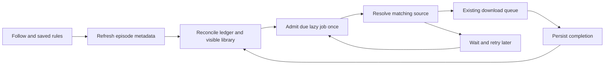

# Automatic downloads for followed series

Status: implemented in 0.5.7 ([#297](https://github.com/NickRabit/stremio-offline/pull/297));
user-facing behavior is in [Downloads](downloads.md#following-a-series). This
document stays as the design record. Research and review date: 2026-10-03.

This document refines the [Follow show delivery contract](roadmap-delivery-spec.md#follow-show).
Discovery-only remains the default; the download behavior below applies after
explicit opt-in. The delivery contract owns product scope and delivery order.

## Recommendation

Build a small owner-bound discovery service with optional automatic downloads
above the existing lazy download queue. Refresh episode metadata separately from
looking for a usable source.
Persist episode decisions independently of queue history. Start with future
episodes over HTTP, explicit language/subtitle rules and a pinned destination.
Raw torrents were proposed as a later milestone; the owner chose to ship them in
the first release instead. A lazy job falls back to a torrent through Real-Debrid
when no HTTP source matches: strict audio is never satisfied by a torrent, an
episode needs a file index, and a file Real-Debrid reports as another episode is
rejected and the next source tried. HTTP always wins.

This is a medium-sized feature involving persistence, queue semantics and account
isolation, rather than a timer around the bulk-download endpoint.

## Inspiration and alternatives

| Project | Relevant approach | Application here |
| --- | --- | --- |
| [Sonarr](https://wiki.servarr.com/sonarr/faq) | Separates monitoring incoming releases from explicit searches for missing episodes. | Separate following future episodes from backfilling old ones; avoid repeatedly searching the entire series. |
| [FlexGet timeframe](https://flexget.com/Plugins/series/timeframe) | Waits for a desired quality before accepting an alternative after a configured period. | A later language grace period could wait for Czech audio before accepting another language. This is an adaptation, not an existing FlexGet language feature. |
| [Medusa](https://github.com/pymedusa/Medusa) | Separates metadata, provider search, download clients and library organization. | Keep subscription scheduling separate from source resolution and file transfer. |

Sonarr's RSS model should not be copied literally: the current Stremio integration
asks for streams of a specific video and has no release-feed integration. We need
bounded polling of due episodes, not an assumption that an addon emits new-release
events. The [Stremio metadata contract](https://github.com/Stremio/stremio-addon-sdk/blob/master/docs/api/responses/meta.md)
provides video IDs and release dates, with season/episode numbers when applicable.
An air date is scheduling information, not proof that a usable source exists.

### Viewer-oriented prior art

These sources describe useful behavior, not a claim that every current app/platform
supports the same controls. Links were checked on the review date.

| Source | Observed behavior | Design implication |
| --- | --- | --- |
| [Plex user request](https://forums.plex.tv/t/request-to-restore-smart-episode-downloads/934312) | Users describe a previous next-N-unwatched download mode and request its return; the thread is demand evidence, not proof of present availability. | Catching up from viewing progress is distinct from downloading newly released episodes. |
| [Netflix Download Next Episode](https://help.netflix.com/en/node/101262) | Deletes a watched downloaded episode and fetches the next over Wi-Fi on supported mobile devices. | Consider a separate progress-driven refill policy; do not copy device deletion semantics directly onto a shared NAS. |
| [Pocket Casts auto downloads](https://support.pocketcasts.com/knowledge-base/auto-downloading-episodes/) and [archiving](https://blog.pocketcasts.com/2019/11/26/archiving/) | Download limits and archiving after playback or by episode limit; archiving preserves play status. | Keep acquisition, retained files and watched history separate. |
| [Stremio episode notifications](https://blog.stremio.com/how-to-use-episode-notifications-in-stremio/) | The published design counts releases since the last viewing interaction, rather than all unseen historical episodes. | Discovery-only/Home is useful independently of downloads; label new-release counts separately from unwatched counts. |

Historical Sonarr reports illustrate both edges we must test:
[#7401](https://github.com/Sonarr/Sonarr/issues/7401) reports missed newly added
episodes within a monitored season, while
[#3619](https://github.com/Sonarr/Sonarr/issues/3619) reports historical episodes
being downloaded after metadata changes. These are regression scenarios, not
claims about current Sonarr defects: late metadata must neither lose an eligible
episode nor implicitly opt the user into the entire back catalogue.

### Relationship to the planned Sonarr/Radarr bridge

The repository already proposes an [HTTP Sonarr/Radarr bridge](arr-integration-spec.md)
and has a protocol probe, not a shipped integration. It explicitly reuses installed
addons, owner permissions and the download queue through Newznab/SAB-compatible
adapters. The bridge is therefore a related delivery path, not an unrelated external
stack. Its specification remains authoritative for its protocol and lifecycle.

Native following is P2a in the roadmap; the bridge is P3. Keep that order because
household users need discovery on Home and optional downloads without configuring
another application, machine credentials, shared staging mounts and import rules.
Sonarr can own monitoring and release selection for users who want it. However,
the first bridge milestone supports interactive and *arr-initiated search commands;
it explicitly defers continuous release discovery/RSS. It does not by itself replace
native discovery. Choosing bridge-only would defer the household feature and require
bringing that later release-discovery milestone forward.

| Responsibility | Native following | Sonarr through the bridge |
| --- | --- | --- |
| Monitoring and selection | Follow service discovers episodes; lazy resolver applies saved rules | Sonarr owns monitoring/quality policy and requests a specific release; initial bridge offers search, not a continuous feed |
| Destination | Explicit local library | Integration staging, then *arr imports/renames the final file |
| Durable identity | Owner + episode + destination, with an intent ledger | Integration + category + release + attempt; intentional re-download may need a new attempt ID |
| Shared services | Owner-scoped metadata, source access, outbound limits, admission and transfer recovery | The same primitives, with integration rights intersected with the owner's rights |

Keep discovery independent of download intent so a later bridge feed can reuse its
bounded metadata refresh and normalized episode identities. Episode discovery is
not release discovery: an RSS milestone still needs source fingerprints, stable
release first-seen times and release-level deduplication. Do not build a second HTTP
downloader or silently substitute another release for the one *arr selected.

Proposed coexistence rule for the later bridge milestone: use one download authority
per series and intended final library: native automation
or Sonarr. Native discovery-only can coexist with Sonarr. Bridge setup must explain
this choice and record externally managed series/targets where known; enabling
native automation for a known external assignment is rejected until that assignment
is explicitly changed. If the bridge cannot know Sonarr's monitoring set or final
import target, setup must require that assignment from the administrator rather
than claim automatic overlap detection. Do not enable a second automatic discovery
path for an unmapped assignment. Existing accepted jobs retain their owner and
lifecycle when management changes.

Share queue admission infrastructure, but preserve library versus staging destination
identity and native intent versus bridge attempt semantics. A native file must not
silently satisfy an *arr-selected release, and removing bridge history must not
create a native skip. Web history cleanup must retain unacknowledged bridge attempts,
as the bridge contract requires. Add coexistence tests for discovery-only plus
Sonarr, a conflicting automatic assignment, separate destinations and bridge import
acknowledgement before enabling both integrations in one instance.

A cron job calling the bulk endpoint remains only a disposable prototype: it lacks
durable decisions, recovery and user-facing state.

## Existing code and actual gaps

Reverified against origin/main at `5ecfd67` after external review; recheck symbols
before implementation. The change since `8f09b4c4` only affects screenshot tests
and baselines, not these application paths.

- `server/src/routes/downloads.ts::registerDownloadRoutes` validates bulk source,
  audio and subtitle choices, snapshots destination settings and creates lazy jobs.
  Extract this validation into a shared service instead of calling an HTTP route
  or duplicating its rules in a scheduler. Its current `titleLanguage` lookup omits
  the viewer, so grant-scoped metadata access must be part of the extraction itself.
- `server/src/downloads.ts::DownloadSelection` already stores addon order, source
  strategy, audio modes, fallback languages, subtitles and destination settings.
  It has no resolution/codec/bitrate quality profile. Largest file is not a
  reliable substitute for quality, especially for unattended downloads.
- `DownloadQueue.addPending(title, source, media?, ownerUserId?)` checks only for
  active jobs sharing `videoId`. It ignores completed/failed jobs and does not
  scope this check by owner, media type or destination. It does not prove that an
  episode is already on disk. Reusing it unchanged would permit repeated downloads
  after completion and wrongly suppress some independent users' requests.
- `DownloadQueue.add` and `addDebrid` also have global duplicate checks, by HTTP
  URL and `sameTorrent` respectively. For two owners receiving the same source,
  these checks can suppress an otherwise permitted request; `add` can return
  `err.sourceDownloaded` based on a completed file in a library the caller cannot
  see. This is an existing isolation defect, not merely a missing follow feature.
  Fix all three admission paths in a separate focused prerequisite with two-owner
  regressions; retain collision protection without exposing private activity.
- `server/src/index.ts::queue.setResolver` filters candidates to `stream.url`;
  `DownloadQueue.resolve` requires a URL. Manual `add` can enter `addDebrid`, but
  lazy raw-torrent resolution is not implemented. An addon returning a ready
  debrid HTTP URL already works; a raw infoHash is a different path.
- `ownerMayDownload`, owner-aware stream resolution and permission pauses provide
  useful enforcement. New background metadata calls must explicitly pass a viewer;
  `cachedMeta` without one can consult all addons. Its current cache lasts six hours.
  On current main, supplying a viewer also enables interactive outbound retries;
  separate authorization scope from interactive priority before using it on a timer.
  Always pass `store.prefs(ownerUserId).uiLanguage` explicitly; omitted language
  falls back to the first account through `prefsOf()`. Read current owner settings
  per check and retain owner/grant/language scoping in refreshed cache entries.
- `MetaItem.videos` is `Array<Record<string, unknown>>`, but
  `library-match.ts::episodesFromMeta` already normalizes episode fields and
  `episodeKey` keys standard numbered episodes. Extract/extend these shared helpers
  rather than writing another parser. Preserve `episode ?? number`,
  `released ?? firstAired` and existing name/description aliases. The current parser
  accepts finite numbers and date strings; follow scheduling additionally needs
  integer/range and date validation, original video ID, provider provenance and
  ambiguity detection. Its default 1,000-entry truncation must be explicit and
  resumable for discovery, not silently lose later episodes. `episodeKey` is usable
  for verified standard numbering, not proof that different providers agree.
  `metadata` fills missing fields rather than merging provider episode lists.
- Library parsing and metadata bindings can help identify existing episodes, but
  `episodes.json` is metadata, not an authoritative inventory of downloaded files.
- `LibraryAutoScan` demonstrates bounded background lifecycle management; it is
  not a series subscription scheduler. Existing favourites/watch lists should not
  acquire download side effects. Following is a separate explicit action.

## User behavior for the first release

On a series detail, following defaults to discovery-only, with new episodes shown
on Home and no queue jobs. Enabling automatic downloads is a separate action with
current download permission and explicit source/destination choices. Its form
reuses the bulk selection controls and adds the start boundary and destination.
The MVP covers standard numbered episodes; season packs, absolute anime numbering,
date-based episodes and specials are outside this first release.
All interface strings must be catalogue keys in both English and Czech. Reuse
`SeriesDownloadDialog`, `SaveTargetDialog` and the documented UI conventions
rather than introducing a separate form system.

For automatic downloads, default to episodes released after download opt-in, not
the earlier discovery-only follow date; include later seasons, exclude
specials, and never download the entire historical catalogue on activation.
Offer an explicit starting episode as an alternative, with a preview of the
currently eligible missing episodes before saving. A future follow can be saved
before any episode airs. If initial metadata cannot be read, keep setup pending
and do not silently establish an empty baseline.

Store the download opt-in instant and its initial episode snapshot. Discovery-only
records retain their own creation time; enabling downloads previews any catch-up. Every refresh
re-evaluates all known IDs against the start boundary, including IDs discovered
late. A valid release date before activation remains historical even if newly
added to the provider. Future-dated episodes wait. Invalid or absent dates require
attention and do not trigger an automatic download in the default mode. Date-only
values use a documented conservative end-of-day UTC boundary. An explicit starting
episode can authorize already-released older entries, but does not make an unknown
release date proof of availability. Conflicting provider numbering requires review.

The subscription pins a writable library ID, subfolder and layout at creation;
resolve a default to a concrete library. Changing addon storage rules must not
silently move future episodes. The existing queue can redirect a permanently missing
rule-based destination after a delay. Current main already supports
`DownloadTargetSettings.explicit`: it fails a removed explicit destination after
the timeout instead of redirecting. Reuse that flag and translate this failure
into a subscription requiring destination repair; do not repeatedly requeue it.

For a new automatic-download policy, explicitly seed the reused controls with
`sourceStrategy: "priority"`. `SeriesDownloadDialog` currently defaults to
`"largest"`; keep that default for existing manual bulk downloads and allow the
follow caller to supply its own initial policy. Editing an existing follow restores
its saved choice, including `"largest"`, rather than resetting it.
Show the existing audio modes honestly:
strict verifies tracks, listed can trust addon language declarations, preferred
can accept other languages. Preserve the selected mode in the subscription.
Fallback in the first release has the same immediate semantics as bulk downloads;
waiting several days for preferred audio is a separate later feature.

Provide a followed-series list with last successful check, next check, next known
episode, pending episodes and actionable reasons. Distinguish not aired yet, waiting
for a matching source, queued/downloading, completed, skipped, paused, and needs
attention. Pausing stops new scheduling and retries; jobs already accepted into the
queue continue and retain ordinary queue controls. Removing a follow leaves files
and accepted jobs intact. Removing a pending automatic job records an explicit
skip so the scheduler does not recreate it. Retry clears that skip explicitly.
Deleting a completed file does not automatically download it again.

The intended flow is:

## Persistence and deduplication

A proposed versioned `series-follows.json` contains subscriptions and their episode
ledger; use serialized atomic writes consistent with existing stores. Keep this
separate from preferences and ephemeral queue history. It is single-server state;
multiple processes sharing the data directory are outside this first design.

Subscription fields: ID, ownerUserId, metadata provider/namespace and series ID,
start mode/boundary, initial snapshot, autoDownload flag, specials policy,
selection snapshot (when downloads are enabled),
resolved destination, enabled state, createdAt, lastCheckedAt, lastSuccessfulCheckAt,
nextCheckAt, configuration revision and last error code.

Episode ledger fields: provider-scoped identity, provider video ID, validated season
and episode, release timestamp, firstSeenAt, state, jobId, stable enqueue key,
attempt count, nextAttemptAt, completion evidence and skip/error reason.

Never identify a show by display title. Use a canonical series/episode identity
where verified; otherwise retain provider namespace plus video ID. Season/episode
numbers are a cross-check and a mapping aid, not permission to merge conflicting
catalogues. Provider changes retain aliases only after an unambiguous mapping.

Deduplication has three distinct layers:

1. Per-subscription durable ledger prevents rediscovery after restart, queue-history
   cleanup, file deletion, or an explicit skip.
2. Queue admission uses an atomic idempotency key under one shared in-process
   admission lock for manual and automatic callers, not a cross-process lock.
   Same-owner manual and automatic requests for the same episode/destination must
   reconcile, including already running jobs. Different owners must not be silently
   merged solely because their provider video IDs match.
3. A verified file in an owner-visible library satisfies a missing episode. An
   unavailable library or ambiguous identity means unknown, not absent. Wait or
   request attention rather than generating another copy. Never disclose another
   account's private library or queue activity to justify a decision.

Discovery records exist without download intents. Persist a download intent only
when automatic downloads are enabled and the episode is eligible. Keep a reserved
intent distinct from a durably accepted queue job.

Reserve the intent in the ledger, persist the idempotency key on the job, then link
its ID back to the ledger. Startup reconciliation repairs the gap after a crash at
any point. Completion evidence must reach durable follow state before completed
queue history can be cleared; persist an acknowledgement or durable completion
event for that handshake. Do not claim two independent JSON writes are a transaction.
Queue integration must cover `add`, `addDebrid` and `addPending`: a manual single-episode
job currently has `media.id`, season and episode but no `source.videoId`. Resolve a
shared canonical episode key where possible and propagate explicit provider/video
identity through the manual request where it is missing. Keep unknown/contradictory
numbering unresolved rather than using season/episode as a universal identifier.
Use owner, verified content identity and concrete destination as the admission
scope; an opaque persisted intent key then connects the queue and ledger.

Add an internal queue lookup by intent key for startup reconciliation; public
`list()` strips `source` and cannot supply the missing identity. Preserve and compose
the existing completion hook, which refreshes the library and records statistics.
Queue loading currently starts the pump immediately: introduce a recovery barrier
so ledger reconciliation finishes before automatic transfers can start. Handle the
rename-to-final-file / queue-save crash window explicitly: verify recorded target
identity and completion evidence, durably settle both stores, and only then allow
execution and history cleanup. A file merely existing is not sufficient evidence.
A corrupt follow ledger must stop automation and surface recovery, never start empty.

### Removal and recovery protocol

`DownloadQueue.remove()` has no removal hook today. Add an awaited pre-removal
boundary or a shared removal service that every authorized removal path uses,
including administrator removal of another user's automatic job. The complete
current mutation surface is:

| Entry point | Required durable behavior |
| --- | --- |
| `remove(id)` / user or administrator removal | Record the intent's skip/removal request before changing the row. |
| `removeMatching(predicate)` / `Revocations.deleteUser` | Use the same per-job cancellation boundary for every unfinished job, with reason `ownerDeleted`. |
| `clearCompleted()` / administrator history cleanup | Check durable completion acknowledgement per row before filtering it out; this method currently bypasses `remove`. Preserve unacknowledged native and bridge records. |

On account deletion, prevent admission immediately once the owner is absent and
durably mark its follows as deleting before cancelling unfinished jobs. Startup
also detects orphaned follows if deletion crashed before that marker. Retain a
minimal cleanup record until job cancellation and ledger cleanup finish; then remove
that owner's follows and intents. Do not recreate them or transfer them to another
account. Completed library media stays, consistent with current account deletion.
A ledger-write failure blocks rescheduling and leaves recoverable cleanup pending;
it must not let a deleted user's running work continue unchecked.

Serialize removal against admission, retry and completion for that intent. Before queue mutation,
persist a tombstone with intent key, job ID, reason and revision: user removal of
an unfinished automatic job means skipped; acknowledged completed-history cleanup
means completed. Preserve tombstones independently of queue history. A failed
ledger write refuses removal and leaves the queue row intact.

After the tombstone is durable, mark cancellation pending and block new admission,
retry and publication for that intent. Clear its debrid poll timer, abort active work
and await the actual per-job transfer/resolver/debrid task settling, including its
final state writes, before partial cleanup, row removal and a durable removal-finished
acknowledgement. `remove()` currently only aborts; `pause()` polls for at most 2.5
seconds, which is not proof of termination. Add a per-job completion handle or
an equivalent definitive acknowledgement. A bounded wait that expires leaves
cancellation pending and visible; it must not report removal complete or free the
intent for reuse. In-flight debrid responses must recheck cancellation before they
schedule another poll or mutate/publish a result. This does not implicitly delete
remote debrid data. Do not hold a lock across an await that requires the same lock
in the task's finalizer: persist the state under the lock, wait outside it, then
reacquire and recheck the revision to finalize removal.

A crash before queue removal leaves a recoverable cancellation that startup
finishes before pumping; a crash after removal retains the same skip. If completion wins the race, preserve
its verified completion evidence and file rather than making it downloadable again.
A crash after intent reservation but before acceptance leaves a nonterminal reserved
intent with no tombstone: only this verified case may be admitted again under the
same key. A previously accepted job that disappears without a removal/completion
record is unresolved and requires reconciliation or attention, not blind requeueing.
History cleanup requires durable completion acknowledgement before deleting rows.
A follow-level retry/reset service owns both retry paths and advances the revision
under the same admission lock after checking current permissions and policy. An
existing failed job uses `queue.retry(jobId)`; a skipped episode whose removal has
fully finished creates a new queue attempt linked to the same episode intent key
and new revision. Never pass a removed job ID to `queue.retry`. Stale removals,
completion callbacks and scheduler results cannot undo the new revision.

Shared-destination collisions across owners need serialized path admission and a
recheck of accessible files when execution starts; sharing another owner's job is
not necessary for the first release.

## Scheduling and retry policy

Proposed defaults, to tune from real addon latency and NAS load:

- Follow the delivery contract: refresh metadata once per enabled show per 24 hours,
  staggered across the day. A later adaptive six-hour interval near release dates
  is a tuning option, not a conflicting MVP default. Keep checking ended shows
  because metadata can change. Metadata failures retain the last successful state
  and retry after 15 minutes, one hour, then six hours, respecting longer Retry-After.
- For a newly eligible episode, try once, then after roughly 1 hour, 6 hours and
  24 hours; subsequently daily up to 30 days and weekly afterwards. Keep it visible
  as waiting; do not silently abandon it. A user-triggered check coalesces with an
  in-flight check and observes the delivery contract's one-minute cooldown.
- Persist nextCheckAt and nextAttemptAt; on restart perform one bounded catch-up,
  not every missed timer tick. Desktop sleep/offline periods take this same path
  on wake/reconnect; elapsed timers must not replay as a burst. A remote server
  continues independently while its desktop client sleeps. Store all schedule,
  release, ledger and tombstone instants in UTC; render them in the viewer's local
  timezone. Reconcile the whole eligible set, not just episodes
  newer than the latest seen episode, so gaps and delayed metadata are recovered.
- Serialize discovery initially (within the delivery contract's maximum of two
  metadata checks). Process at most 20 new intents per show per pass with a durable
  continuation cursor, and cap outstanding automatic admissions at 20 globally.
  Give manual work priority and drain a season release incrementally.
  The global cap is an additional proposed safeguard beyond the delivery contract.
  The queue remains responsible for transfer concurrency and disk pressure.
- Respect the outbound host guard and Retry-After. Bound probes through the current
  selection budget. Add an explicit freshness option, separate from viewer and
  interactive priority: a due metadata check bypasses the six-hour metadata cache,
  coalesces identical authorized in-flight work and updates the scoped cache.
  A due source retry bypasses the five-minute stream cache at lazy resolution;
  it does not fetch streams for every discovered episode. A rate-limited Check now
  refreshes metadata and marks relevant waiting intents to request fresh streams
  when admitted, including bypass of cached empty results. If admission is delayed,
  say so rather than claiming sources were already checked. Deduplicate refreshes
  per authorized scope and honor host cooldowns; freshness never bypasses permissions,
  circuit breakers or rate limits. Routine browsing may keep its existing cache.

Discovery records episodes; opt-in automation reserves intents and admits lightweight
lazy jobs. Neither path may ffprobe all episodes every tick. Source resolution runs with a bounded budget when admitted.
Extend the existing `download-policy.ts::classifyFailure` contract rather than
introducing a parallel error taxonomy. It already declares transient/source/storage/
pause classes and recognizes structured `HttpSourceError` and `StorageError`, with
message parsing as a fallback. The narrower gap is that `resolve()` throws a
`SourceError` for an absent matching source, and `classifyFailure` classifies it as
a source failure, ending the attempt when there is no selected stream to replace.
Add a typed resolution reason for not-yet-available and preserve typed provider,
authentication, configuration and storage causes through addon/resolver boundaries.
The follow policy maps unavailable to a delayed retry and actionable configuration
or permission problems to attention/pause; transport retries keep the existing
bounded transfer policy. Carry stable reason codes and catalogue keys, never infer
these decisions from English text.
Retry must reuse the existing failed job through a controlled `queue.retry(jobId)`
path after checking eligibility; repeated `addPending` calls create failed copies.
If a reserved intent never reached durable acceptance, re-admit under its stable
key only after reconciliation proves the removal/recovery protocol permits it.
A missing previously accepted job is not sufficient evidence for re-admission.
Changing rules applies to future intents; accepted jobs keep their snapshot unless explicitly
retried with updated rules. Reject stale outcomes from an earlier revision.
A cancelled attempt, a reconfigured follow and an old in-flight refresh must not
race into a new job: recheck enabled state and configuration revision after awaits.

## Permissions and operational limits

Every subscription has a real owner. Check current account/content grants before
discovery. Automatic downloads additionally require current download permission,
source grants and destination visibility before source access, admission and
execution, and again after network awaits. Never impersonate the first account.
Disabling or deleting an account stops its automation. Revoked download permission
pauses downloads while permitted discovery-only checks may continue; revoked content
rights stop the affected discovery too. The delivery contract's prohibition on
child accounts enabling automatic downloads depends on the planned P1b child-mode
policy. Current `Role` is only `admin | user`; no child role is implemented. Once
P1b lands, enforce its server-side child restriction here as well. Before then,
use current download permissions and do not claim to enforce a child distinction
that the server does not represent. Revoking an addon/library pauses affected
work; it must not broaden access or choose another destination.

Bound subscriptions per user, outstanding automatic intents and per-run work;
expose administrator limits without introducing a billing/quota subsystem. Do not
log private addon URLs or stream tokens. Include counts and stable error codes in
diagnostics. Persisted retry delays must not occupy transfer slots. Source resolution currently
occupies a queue slot, including ffprobe: the first release should keep this bounded
behavior and document that an active automatic resolution can briefly delay manual
work. Add an explicit manual/automatic origin and admission priority for jobs not
yet started; do not promise preemption. A separate bounded resolver lane can follow
if measured latency warrants the additional queue complexity. Preserve the
existing disk-headroom protection; do not promise a strict maximum file size until
that is explicitly implemented and tested.

Document backup scope: current settings export does not automatically include new
follow data. Initially preserve it in a full data-directory backup; a portable
settings import must not silently activate downloads under a different owner.

## Later: download ahead of viewing and retention

Keep the first release unchanged. Model the start boundary separately from a
versioned acquisition policy so a later `aheadOfViewing` mode can coexist with the
initial release-based policy. Its promise is "keep N released, unwatched episodes
ready from my chosen viewing position", including older seasons. Preview and
explicitly authorize this mode: it must not reuse the future-release boundary to
exclude the very historical episodes the user wants to catch up on.

Reevaluate that window on verified completion/progress changes and metadata refresh,
with the same due-work bounds and admission service. Count matching accessible files
and accepted intents toward N so repeated progress events cannot overfill it. Missing
release dates still need resolution; unavailable sources remain visible holes rather
than triggering an unbounded search through the catalogue. The later design must
specify whether it can fill beyond such a hole, without treating the hole as watched.

Existing `progress-series.ts::seriesOf`, `next-episode.ts::nextEpisodeOf` and
`routes/personal.ts` provide useful identity, ordering and completion signals.
They are not a complete watched ledger: completed positions are removed, only a
bounded recent series-marker set survives, and the user can clear that state.
Reuse those signals with a durable owner-specific anchor/revision and any required
episode-completion evidence. Missing or cleared progress pauses window advancement
until an explicit anchor is selected; it must not silently reset to season one.
Watching an episode out of order does not establish that every earlier one was seen.

Retention is a separate, explicit later policy: keep the latest N managed files,
or remove managed files after watching. Neither follows automatically from selecting
N-ahead acquisition, and the MVP does not cap total retained media. Keep semantic
completion/skip history independent of file residency, with a removal reason such
as `retention` distinct from manual deletion, cancellation and external import.
Retention removal must not reset an episode to missing and start a download/delete
loop; deliberate re-download remains an explicit revision of the intent.

Automatic deletion on a shared NAS needs its own authorization and recovery gate.
Default retention to off. Initially restrict it to a dedicated administrator-approved
managed destination, or require an explicit shared-library retention agreement before
a viewer's completion can remove a household file. A follow's creator does not own
every matching file: preserve manually imported files, other owners' requirements,
active playback/transfers and *arr-managed imports. Use existing authorized library
operations with durable deletion provenance; stop when ownership or current use is
uncertain. A NAS policy should use the NAS's network state, not infer Wi-Fi safety
from a remote phone's connection.

An upcoming-episodes view or authenticated, revocable calendar export is another
later discovery feature. It should reuse dates and per-owner visibility; an .ics
feed is not assumed to be a free implementation detail or an existing Stremio
Offline capability.

## Implementation slices and validation

0. Fix the existing cross-owner admission defect across `add`, `addDebrid` and
   `addPending` separately, with shared-source/private-library regression coverage.
1. Durable follow model, shared episode normalization, inventory reconciliation and queue
   idempotency/completion handshake. Domain tests cover concurrent admission,
   completion-history cleanup, file deletion, skips, inaccessible libraries,
   provider aliases and every crash boundary, including both sides of tombstone
   persistence and queue removal, completion racing removal, and an unexplained
   missing accepted job. Cover `remove`, `removeMatching` during account deletion,
   and `clearCompleted` explicitly. A delayed abort/finalizer, expired cancellation
   wait, or in-flight debrid response must not publish or admit replacement work;
   repeat recovery twice and assert no automatic recreation.
2. Owner-bound scheduler and structured source outcomes. Fake-clock tests cover
   future and invalid dates, late metadata, changed dates, outages, restart catch-up,
   bounded season batches, retries, pause/configuration races and revocation during
   an awaited request. Test explicit owner language, due-check cache bypass,
   empty stream results followed by an available source, request coalescing and
   preserved host cooldowns, desktop wake/offline catch-up and UTC/local rendering.
   Extend the existing failure-classification tests.
   HTTP sources only, including ready debrid URLs.
3. Localized detail form and followed-series management. API tests prove isolation
   between two users and cross-owner same-video behavior. Verify that discovery-only
   creates no jobs, a new follow defaults to priority, manual bulk still defaults
   to largest, and editing restores the saved policy. A small Docker e2e flow
   uses a controllable addon: discover, no matching source, later source, one file,
   restart, no duplicate. Run visual verification once functional behavior is stable.
4. Separate raw-torrent/Real-Debrid milestone closes the stated delivery-contract
   deviation. It needs deterministic episode-file selection, waiting-state recovery,
   cancellation tests and safe rejection of unsupported season-pack ambiguity;
   it is not just removing the URL filter or promising general season-pack support.
5. Optional extensions: language grace period, real quality/size profiles, explicit
   historical backfill, N-ahead viewing, opt-in keep-last-N/delete-after-watched
   retention, notifications and calendar. Before retention ships, test two viewers,
   out-of-order or cleared progress, protected/imported files, active playback,
   restart during deletion and prevention of re-download loops.

For implementation PRs, run the project build and unit suites, relevant Docker e2e,
and local Docker deployment/health verification required by AGENTS.md. This proposal
changes documentation only; no application behavior or version changes are made.

## Decision before implementation

Recommended first scope: discovery-only by default with opt-in downloads of
future episodes or an explicit starting episode,
HTTP sources, current audio/subtitle rules, concrete destination, pause/skip,
visible waiting reasons and no upgrades or automatic re-download after deletion.
Decided by the owner: Real-Debrid torrents ship in the first release (see the
recommendation above), and there is no preferred-audio grace period yet; the
fallback applies immediately, as in bulk downloads.

## Independent review

DeepSeek Flash reviewed the design and current source in an isolated worktree.
The parent independently checked the findings against the named functions; this
was static analysis, not execution-based validation. Accepted clarifications cover
metadata grants versus interactive priority, manual/bulk identity reconciliation,
failed-job reuse, internal intent lookup, completion durability, startup admission
and the limits of manual priority. These requirements are incorporated above.

One reported authorization defect was rejected: queue move and global history
clear are administrator-only through `server/src/roles.ts::roleMiddleware`, even
though the route bodies do not repeat the guard. Preserve those restrictions.
Provider payload compatibility still needs fixture and real-addon checks during
implementation; no live addon credentials or production downloads were used here.

External review was also checked against the current code and the existing *arr
and delivery specifications. This revision documents the bridge relationship and
coexistence boundary, strengthens the removal protocol, flags all three admission
paths, extends existing normalization/error contracts and defines freshness,
owner-language and form-default behavior. The earlier text already required a
skip before removal; the missing detail was an enforceable boundary and crash
recovery, not a requirement to re-add every missing job. Existing classification
is structured; preserve it and add the missing resolution reasons.

The second supplied review was verified against queue removal, revocation and
progress code. Its removal/lifecycle and delivery-scope clarifications are included;
viewer-oriented sources were checked directly before adding later acquisition and
retention options. Moving the follow ledger into `store.ts` alone would not make
queue acceptance transactional because downloads still use a separate state file.
The admission lock is within one process and prevents interleaving across awaits;
no distributed lock or new persistence engine is proposed.
