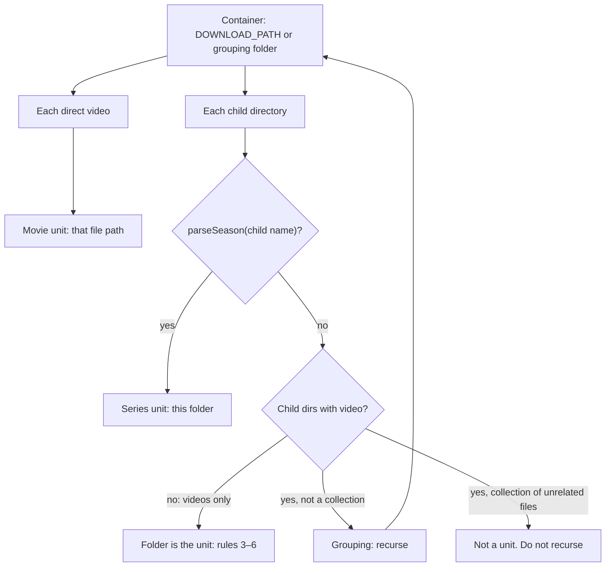
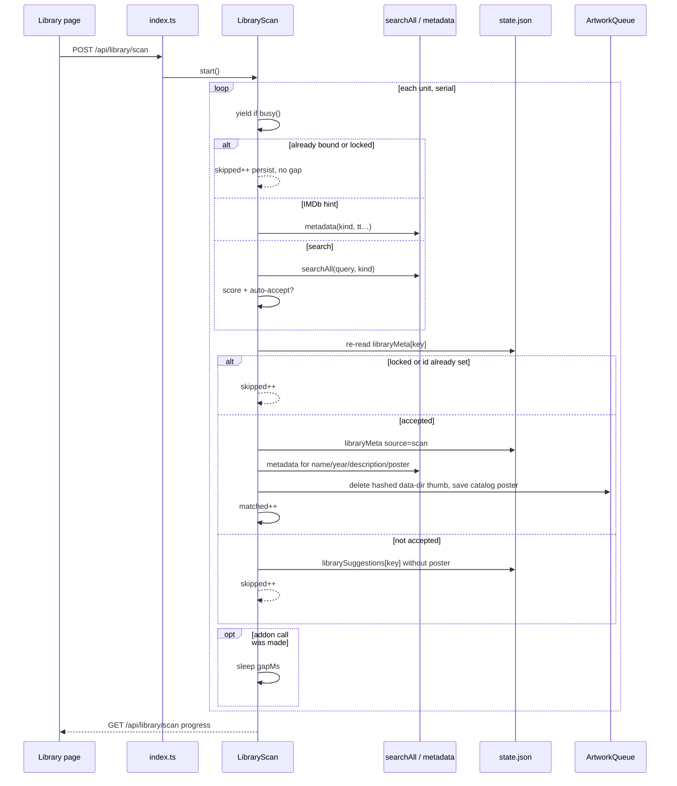
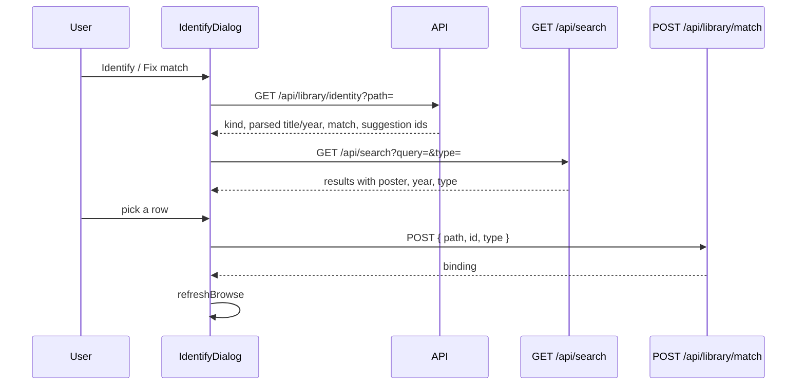

# Library Metadata Enrichment

| Field | Value |
| --- | --- |
| Author | Engineering |
| Date | 2026-09-08 |
| Status | Draft |
| Product | Stremio Offline |
| Related | `server/src/library.ts`, `server/src/addons.ts`, `server/src/artwork.ts`, `server/src/index.ts`, `docs/downloads.md` |

## Overview

When `DOWNLOAD_PATH` points at an existing media tree, most folders have no catalog poster and no description. Bindings in `store.libraryMeta` exist only for titles that arrived through the download queue (`rememberTitle` in `server/src/index.ts`) or through the unused `POST /api/library/match` endpoint. `libraryEntries()` is explicit about this: metadata is attached only where the id is already known; nothing is guessed from the folder name.

This design is the controlled exception to that rule. A path parser plus a Plex-style scorer identify title units from directory structure (not from a movie/TV library picker). Grouping folders such as `Webshare/Movies` are walked; collections of unrelated videos are not. A durable, user-triggered background job auto-accepts only high-confidence matches via the same `searchAll()` / `metadata()` path the catalog already uses. Everything else stays unmatched until the user runs Identify from the three-dot menu. Manual rematches are locked against later scans; Unmatch is reversible by Identify. The library browse UI starts showing year, description, and match status, so already-downloaded titles look closer to catalog cards without becoming a media-server catalog.

Cinemeta names every title the library matches against, so it is treated as
essential (`essentialAddon` in `server/src/security.ts`): the API refuses to
delete it, to switch it off, or to demote it to a stream-only role, and the addon
card hides those controls. Any other catalogue addon stays fully removable.

## Background & Motivation

### Current state

- `buildLibrary()` (`server/src/library.ts`) groups by the first path component. `kind` is `series` if any file has path depth ≥ 3 (a season folder), `collection` if multiple files without seasons, else `movie`. `parseSeason` understands `01 serie`, `Season 2`, `S03`. `parseEpisode` understands `S01E07` and leading `07 - Title`. Neither strips quality tags, years, or provider ids. Matching does **not** reuse the depth ≥ 3 rule (it would mark `Movies/Title/file.mkv` as one series named “Movies”).
- Real trees on this install: `Practical Magic/Practical Magic.mkv` (movie), `Father Ted/01 serie/01 - Good Luck, Father Ted.mkv` (series), `xxx/*.mp4` (unrelated collection), bilingual Czech/English names with quality tags and years (`Jižanská pohostinnost-Southern Comfort CZ dabing.Dobrodružný Válečný 1981.avi/`). Addon save rules already nest under subfolders (`docs/downloads.md`: `Webshare/Movies`).
- `store.libraryMeta` is `Record<string, { type: string; id: string }>` in `data/state.json`. Keys are relative paths. `knownTitle()` walks parents. Delete/rename/move remaps `favorites`, `libraryMeta`, and `progress` only. A move to another folder first pins what the item inherited (`pinInherited`) onto its own key, or the destination folder's binding would take it over.
- Metadata comes from enabled catalog addons that declare `meta` (`metadata()` in `server/src/addons.ts`). Default is official Cinemeta (`https://v3-cinemeta.strem.io/manifest.json`, `idPrefixes: ["tt"]`). Search is `searchAll()` → `GET /api/search`, cursor-paginated.
- Artwork: `ArtworkQueue` is one-at-a-time. An item keeps two pictures, a portrait poster and a landscape backdrop, and each is looked for the same way. Local files always win: `POSTER_NAMES` for the poster, `BACKDROP_NAMES` for the backdrop. Missing art: the catalogue's `poster` or `background` if `libraryMeta` exists, else an ffmpeg thumbnail, which is landscape and so serves the backdrop directly. Written next to the media only where the library's `writeArtwork` allows it — `poster.jpg` and `backdrop.jpg` — and to the hashed data-dir file otherwise, where the backdrop takes a `#wide` key of its own (see [multi-library.md](multi-library.md) §8). Browse schedules both as a side effect of `GET /api/library/browse`, and a missing backdrop is retried at most every six hours.
- `POST /api/library/match` `{ key, id, type }` exists and is allowed in restricted mode (`ALLOWED_MUTATIONS` in `server/src/restricted.ts`). The web client has no helper and no UI (`web/src/api.ts`). Empty `id` deletes the key. The handler does not `resolveInside`, fetch meta, invalidate `libraryCache`, or schedule a poster.
- Library browse tiles show name, file count, size. `LibraryEntry.meta` already carries `description` and `year` when a binding exists, but `GET /api/library/browse` does not return them and `web/src/App.tsx` does not render them. `api.library()` / `GET /api/library` is unused by the web client.

### Pain

Pointing `DOWNLOAD_PATH` at a NAS dump of hundreds of titles leaves a grid of ffmpeg thumbs and folder names. Wrong auto-matched posters (Czech title → English Cinemeta near-miss, or a collection folder matched as one movie) are worse than no poster. Plex/Emby/Jellyfin already taught the expected workflow: parse path → search provider → score → auto-accept only at high confidence; Identify for the rest.

## Goals & Non-Goals

### Goals

- Infer movie vs series vs collection from directory structure, including season folders named `01 serie`, series that keep every `SxxExx` file in one folder, nested addon subfolders (`Webshare/Movies/Title`), and loose files at `DOWNLOAD_PATH` next to title folders (`Interstellar.avi` + `Practical Magic/`).
- Parse a relative path into a cleaned title, optional year, optional season/episode, and optional IMDb/TMDB/TVDB hints. Strip quality/release tags. The L0 table is the definition of the parser.
- Auto-match only at high confidence, using installed catalog/meta addons. Persist identity as `type` + catalog id keyed by relative path.
- A durable, user-visible scan job that identifies unmatched title units serially, yields to playback and downloads, and survives restart.
- Manual Identify / Unmatch from the existing three-dot menu. User choice always wins over the scanner. Unmatch is reversible by Identify.
- Show year + one-line description on library tiles, including titles that arrived through the download queue. Browse API returns `description`, `year`, and match status. Fill cache fields at every bind, plus a cheap serial backfill when browse sees an id with empty cache — not via unused `GET /api/library`.
- Stay within Celeron NAS budgets: one in-flight identification, reuse `ArtworkQueue` / addon guard, never overwrite local `POSTER_NAMES` files. Replace generated hashed data-dir thumbs with the catalog poster after a match.

### Non-Goals

- A TMDB (or any) API token in Settings. No second identity system, no extra secret.
- Silent low-confidence auto-match of the whole disk.
- A Plex-style separate movie library vs TV library picker.
- Renaming folders to the catalog title after a match (paths are identity for favorites and progress; rename is already a separate action).
- NFO / `.plexmatch` sidecars (later).
- OpenSubtitles / ffmpeg hash lookup.
- Generating ffmpeg thumbs as part of the scan job. Identification only. Catalog posters may replace a hashed data-dir thumb; they never replace `poster.jpg` / `folder.jpg` in the media folder.
- Matching individual episodes of a series to episode-level meta. The show folder is the unit.
- Changing the library from a filesystem browser into a catalog (no streams sheet on a library tile).
- Recursing into folders that already contain unrelated direct videos (the adult-dump guard). Identify on a child of such a folder still works.

## Proposed Design

### Module layout

Keep `library.ts` as the filesystem browser. Matching is a new concern:

| File | Responsibility |
| --- | --- |
| `server/src/library.ts` | Existing browser, plus a public `listVideos(root)` (the walk `scanLibrary` already uses). |
| `server/src/library-parse.ts` | `parseMediaPath(relative)`: quality strip, year, id tags, title, season/episode. Pure. No authoritative `kind`. |
| `server/src/library-match.ts` | Title units, scoring, auto-accept, `matchKeyFor(path)`, tiny `levenshtein`. Pure given search results. |
| `server/src/library-scan.ts` | `LibraryScan` singleton: persist to `data/library-scan.json`, serial worker, pause/resume, progress. |
| `server/src/library-parse.test.ts` | L0 parser cases. The examples table is the test list. |
| `server/src/library-match.test.ts` | L0 units, scoring, lock semantics, grouping-folder recursion. |
| `server/src/library-scan.test.ts` | L0 persistence, skip rules, busy yield, pre-write re-read, gap=0. |
| `web/src/IdentifyDialog.tsx` | **New** Identify UI (there is no Identify in `App.tsx` today). |

`index.ts` constructs one `LibraryScan` (same shape as `DownloadQueue`) and wires HTTP, `rememberTitle`, artwork, and backfill to the store / addons / queue / playback. It does not grow another 400 lines of parsing.

### Title units (what gets matched)

A **title unit** is the thing we search for and the key we write to `libraryMeta`. It is not every video file.

`titleUnits` walks from `DOWNLOAD_PATH` (always a **container**) and from every **grouping folder**. Do **not** treat path depth ≥ 3 as “this is a series.”

A **container** emits a movie unit for **every** direct video file (`key` = that relative path), regardless of sibling folders, then classifies each child directory independently.

- `DOWNLOAD_PATH` itself is always a container. `Interstellar.avi` next to `Practical Magic/` is two movie units, not a reason to skip the file.
- A **grouping folder** is a child directory with no immediate child whose name `parseSeason` accepts, at least one child directory that contains video, and **not** a collection (rule 7). Recurse into it. Direct videos sitting next to title folders (`Webshare/Movies/leftover.mkv` beside `Title/`) are each movie units.
- A **non-grouping folder that contains only videos** (no child directory with video) is the unit: apply rules 3–6 to the folder, not to each file.



Rules, applied to each candidate folder (root children, then children of grouping folders):

1. **Loose video at a container** — every direct video file under `DOWNLOAD_PATH` or under a grouping folder is a movie unit. Key = that relative path. Sibling folders do not suppress it. `matchKeyFor` on that file is the file itself.
2. **Season-structured series** — at least one **immediate** child directory whose name `parseSeason` accepts (`Father Ted/01 serie/…`, `Show/Season 01/…`) → one series unit at this folder. Key = `Father Ted`. Children inherit via `knownTitle()`. Do not match each episode. Do not use “any descendant is depth ≥ 3.” Direct videos beside season folders (`bonus.mkv`) inherit; they are not their own units.
3. **Flat series** — a non-grouping folder (videos only, no child directory with video) where a majority of **direct** videos parse as tagged `SxxExx` (`Show/S01E01.mkv`, `Show/S01E02.mkv`) → one series unit at this folder. Browse `kind` may still be `collection`; matching kind and browse kind may differ in v1.
4. **Single-file movie folder** (`Practical Magic/Practical Magic.mkv`, or `Webshare/Movies/Practical Magic/…` after recursion) → one movie unit. Key = the movie folder, not `Webshare` or `Movies`.
5. **Same-title copies** (`Obsession/Obsession.mkv` and `Obsession (2).mkv`) in a videos-only folder → after cleaning, every **non-extra** file shares one title → one movie unit at the folder.
6. **Extras next to one movie** — a file is extra-named if a whole token of its cleaned name is `trailer`, `sample`, `extra`, or `bonus`. A videos-only folder is a movie unit when there is **exactly one non-extra video** and every other video is extra-named (covers `Movie.mkv` + `Movie-trailer.mkv`, which is 50% extras and must not be a collection). An extras-only folder (no non-extra video) is not a title unit.
7. **Collection** (`xxx/*.mp4` with two or more unrelated direct names) → **not a title unit**. Do **not** recurse, even if the folder also has subfolders (`xxx/I Prefer Anal/`). Do **not** emit each direct file as an auto-scan unit (that would send adult filenames to Cinemeta). The scanner never writes `libraryMeta["xxx"]`. Identify on a child file or child movie-folder binds that child (`matchKeyFor` = the file or that subfolder). Identify on the collection folder itself is a user override, not the default target.

A file added during a scan waits for the next run (`remaining` is frozen at start).

Ambiguous cases:

| Situation | Matching kind | Auto-scan |
| --- | --- | --- |
| `Interstellar.avi` + `Practical Magic/Practical Magic.mkv` at root | two movie units (`Interstellar.avi`, `Practical Magic`) | match both |
| `Webshare/Movies/Title/file.mkv` | `Webshare` and `Movies` are grouping folders; `Title` is a movie unit | match `Title` |
| `Webshare/Movies/leftover.mkv` beside `Title/` | leftover file is a movie unit; `Title` is a movie unit | match both |
| Movie folder with one main video and extra-named siblings | movie | match the folder |
| Two non-extra videos with different cleaned titles | collection | skip; do not recurse |
| Series folder with `01 serie/` plus a `bonus.mkv` beside it | series (`parseSeason` on an immediate child) | match the show |
| Movie that sits in `Name/Season 1/file.mkv` | series (structure wins) | match as series; Identify can toggle to movie |
| Empty folder / non-video | ignored | skip |

`titleUnits(files: FoundFile[]): TitleUnit[]` lives in `library-match.ts`. It needs the walk result, not `LibraryEntry[]`.

Export from `library.ts` (PR 1), next to `scanLibrary`:

```ts
export interface FoundFile { relative: string; size: number; modified: string }

/** Every video under root, same walk `scanLibrary` uses. Depth cap 8, skip dotfiles. */
export async function listVideos(root: string): Promise<FoundFile[]>
```

`FoundFile` is the existing private shape, made public. `library-scan` calls `listVideos(DOWNLOAD_DIR)` then `titleUnits`. Do not reconstruct files from `LibraryEntry`.

```ts
export type TitleKind = "movie" | "series";

export interface TitleUnit {
  key: string;           // libraryMeta key, relative path
  kind: TitleKind;       // from the rules above; drives searchAll type
  relative: string;      // same as key
  sampleFiles: string[]; // videos used to decide kind / extras
}
```

Collections and grouping folders are omitted from this list. Loose files at a container are on the list. Identify on a collection child or nested movie folder builds a one-off unit for that path via `matchKeyFor`.

`parseMediaPath` does not decide `kind`. Filename-only hints (`SxxExx` in the folder name) are recorded as `season` / `episode` on `ParsedMedia`. Scan and Identify take `type` from `TitleUnit.kind` (or the user’s toggle).

### Path parsing

`parseMediaPath(relative: string): ParsedMedia` is a pure function. `parseSeason` / `parseEpisode` stay as they are for browse labels; the new parser runs on a copy of the path and is the only place quality tags come off.

The function runs on the **title-unit key** (folder name or root filename), not on every episode filename. For a series unit `Father Ted`, the input is `Father Ted`, not `01 serie`.

```ts
export interface ParsedMedia {
  title: string;             // cleaned, display-ready
  query: string;             // what we send to searchAll (may prefer the English segment)
  year?: number;
  season?: number;
  episode?: number;
  providerHints?: { imdb?: string; tmdb?: string; tvdb?: string };
}
```

`ParsedMedia` has no `kind`. Best-effort season/episode from the string must not drive Identify or scan `searchAll` type.

Pipeline — each step’s output is the next step’s input. L0 tests are the definition; the table below is that test list.

**Closed token lists** (export from `library-parse.ts`, case-insensitive):

```ts
export const QUALITY_TOKENS = [
  "2160p", "1080p", "720p", "576p", "480p", "4k", "uhd",
  "hdr", "hdr10", "hdr10+", "hdrplus", "dv",
  "web-dl", "webrip", "hdtv", "bdrip", "bluray", "blu-ray", "remux",
  "dvdrip", "dvdscr",
  "proper", "repack", "unrated", "extended", "theatrical", "remastered",
  "czdab", "dabing",
  "ac3", "eac3", "ddp", "dts", "dtshd", "truehd", "atmos", "aac", "mp3", "flac", "opus",
  "x264", "x265", "h264", "h265", "hevc", "avc", "xvid", "divx",
  "10bit", "8bit", "hires",
] as const;

/** Longest first. Never split into `cut`, `vision`, `audio`. */
export const QUALITY_PHRASES = [
  "dolby vision",
  "directors cut",
  "dual audio",
  "cz dabing",
] as const;

/** End-of-string only, after the year has been removed. */
export const CZECH_GENRE_TOKENS = [
  "akční", "akcni", "animovaný", "animovany",
  "dobrodružný", "dobrodruzny", "dokumentární", "dokumentarni",
  "drama", "fantasy", "horor", "komedie", "krimi",
  "muzikál", "muzikal", "rodinný", "rodinny",
  "sci-fi", "scifi", "thriller",
  "válečný", "valecny", "western",
  "životopisný", "zivotopisny",
] as const;
```

Short English words that appear in real titles (`web`, `internal`, `limited`, `cut`, `cam`, `ts`, `tc`, `multi`, `subs`) are **not** in v1. `5.1` / `7.1` are handled as a regex on the pre-space string, not as tokens after `.` → space.

Steps:

1. Drop the extension if the last segment looks like a file (`path.extname` in the existing `VIDEO` set).
2. Extract provider id tags, then remove them:
   - Plex: `{imdb-tt1234567}`, `{tmdb-123}`, `{tvdb-123}`
   - Jellyfin/Emby: `[imdbid-tt1234567]`, `[tmdbid-123]`, `[tvdbid-123]`
   - Loose: `imdb-tt1234567` as a token
   - IMDb values are normalised to `tt` + digits.
3. Extract a year. `(2019)` first. Else a **whole** dotted, underscored, or spaced part that is exactly `19xx` or `20xx` (four digits). That part **is** a year even when the next part is `1080p`: `The.Movie.2020.1080p.BluRay.x264-GROUP` → year **2020** (this row of the L0 table). Reject only (a) digits *inside* a quality token (`1080p`, `2160p` — the year is not `1080`) and (b) digits glued to `Sxx` / `Exx` (`S02E01`, `S2020E01`). First plausible year wins. Remove it from the string.
4. **Before** `.`/`_` → space, strip dotted and hyphenated quality tokens. Split the current string on `.`, `_`, and space; drop any part that equals a `QUALITY_TOKENS` entry; also drop a trailing `-GROUP` on a part (`x264-GROUP` → drop the whole part once `x264` is a known token **or** treat `x264-GROUP` as token `x264` + group `GROUP`). Strip `\b[57]\.1\b` here so channel layout does not become `5 1`. Rejoin with spaces. If step 3 found no year, run the same year rule again on the leftover parts (`The Movie 2020` after quality strip).
5. Replace remaining `.` and `_` with spaces; collapse whitespace; Unicode NFC. If still no year, run the year rule once more on whitespace tokens.
6. Iterate until stable (max 8 rounds):
   - Drop `QUALITY_PHRASES` as whole phrases, longest first.
   - Drop `QUALITY_TOKENS` as whole tokens.
   - Drop a trailing release group: last token matches `^[A-Za-z0-9]{2,15}$` and was attached with a hyphen in the pre-space string, **or** the last token is `-GROUP` / a token that started with `-`. After step 4 this usually already went; the loop catches `Title GROUP` only when the original had `-GROUP`. Safer rule: only strip a last token if the **original** (pre-step-5) string ended with `-[A-Za-z0-9]{2,15}` before the extension. Do not strip a last word that was a real word (`The Movie`).
7. Strip `CZECH_GENRE_TOKENS` only as a trailing run of whole tokens. Do not strip them from the middle of a title.
8. Season/episode: if the string still contains `S01E07` / `1x07`, record them and remove that token from the title. Folder-level `parseSeason("01 serie")` is **not** applied to the show’s own key.
9. Bilingual query. `title` is the full cleaned string. `query` defaults to `title`. Then, if a split yields one side that is mostly Latin `[A-Za-z0-9 ]` and another that has combining marks or Latin letters with diacritics, set `query` to the Latin side. Split on, in order:
   - ` / `
   - ` | `
   - ` - ` (hyphen with spaces)
   - a hyphen **without** spaces (`-`) when the character classes on each side differ as above

   The dump folder `Jižanská pohostinnost-Southern Comfort` has no spaces around the hyphen; that split is required.

Worked examples — these rows **are** `library-parse.test.ts`:

| Input | title | query | year | hints |
| --- | --- | --- | --- | --- |
| `Practical Magic/Practical Magic.mkv` | Practical Magic | Practical Magic | — | — |
| `Father Ted` (unit key) | Father Ted | Father Ted | — | — |
| `Movie Name (2019)/file.mkv` | Movie Name | Movie Name | 2019 | — |
| `Show Name (2015) {imdb-tt123}` | Show Name | Show Name | 2015 | imdb=`tt123` |
| `Name [tmdbid-123] [imdbid-tt456].mkv` | Name | Name | — | tmdb=`123`, imdb=`tt456` |
| `Jižanská pohostinnost-Southern Comfort CZ dabing.Dobrodružný Válečný 1981.avi` | Jižanská pohostinnost-Southern Comfort | Southern Comfort | 1981 | — |
| `The.Movie.2020.1080p.BluRay.x264-GROUP.mkv` | The Movie | The Movie | 2020 | — |
| `Internal Affairs (2002)` | Internal Affairs | Internal Affairs | 2002 | — |
| `The Cut (2014)` | The Cut | The Cut | 2014 | — |

`parseSeason` / `parseEpisode` are **not** extended to strip quality tags. Browse labels keep using them. Tests in `library.test.ts` stay green without rewriting episode titles.

### Matching / scoring

Reuse `searchAll(addons, query, type?)`. The scan passes `type` from `TitleUnit.kind` (`movie` or `series`) to cut the fan-out. Identify uses whatever the user toggled (may be omitted).

**First `searchAll` page only.** The function is cursor-paginated; a unique hit that only appears on page 2 is not auto-accepted. The auto-accept bar is high enough that paging is not worth a second addon round-trip per title. Identify can page if we later wire `hasMore`; v1 Identify also uses the first page.

IMDb in the path is an exact match: `metadata(addons, unit.kind, "tt…")`. If that returns null, try the other type once. No search. If both fail, leave unmatched (the id may be for an addon that is not installed).

TMDB-only id:

- If any enabled catalog/meta addon declares an `idPrefixes` entry that the id starts with (`tmdb:`, `tmdb`, …), call `metadata(addons, type, id)` with the addon's prefix. Do not invent a TMDB HTTP client.
- Otherwise ignore the TMDB id for lookup and search by title + year. Same for TVDB.

Scoring starts at 100 and only applies to search results (not to exact-id hits).

Tiny `levenshtein(a: string, b: string): number` lives in `library-match.ts` (Wagner–Fischer on JS string units / UTF-16 code units after normalisation). No new dependency. Both sides of the title comparison are already ASCII-folded.

```ts
export interface ScoredHit {
  item: MetaItem;
  score: number;          // 0–100
  titleSimilarity: number; // 0–1
  yearDelta?: number;
}

export function scoreHit(parsed: ParsedMedia, item: MetaItem, expectedKind?: TitleKind): ScoredHit
```

- **Title.** Normalise both sides: lowercase, NFD strip diacritics, drop `the` / `a` / `an` prefixes, drop punctuation. Similarity = token Dice (`2|∩|/(|A|+|B|)`) mixed 70/30 with `1 - levenshtein/maxLen` (`maxLen` 0 → similarity 1). Penalty = `round((1 - similarity) * 50)`. Exact normalised match: 0 penalty.
- **Year.** Compare `parsed.year` to `Number(String(item.releaseInfo ?? item.year).slice(0, 4))` (Cinemeta series `1995-1998` → 1995; e2e fixture `"2024"` works). Exact: 0. ±1: −10. ±2: −20. Missing on either side: 0. `|delta| > 2`: −40 and the hit is **ineligible for auto-accept**.
- **Type.** If `item.type` is present and `expectedKind` is present and they disagree, −25 and ineligible for auto-accept. Scan always passes `type` into `searchAll`, so catalogs are already filtered; the penalty still applies to Identify searches that pass no type, and to addons that return mixed types anyway.
- Clamp to `[0, 100]`.

Auto-accept (write `libraryMeta`) only when one of:

1. IMDb hint resolved via `metadata()`.
2. TMDB/TVDB hint resolved via an addon that actually supports that prefix.
3. Exactly one search result, year match or both years missing, `titleSimilarity >= 0.90`, score ≥ 85.
4. Top score ≥ 85 **and** `top.score - second.score >= 15`, year eligible, type eligible.

Otherwise: do not write `libraryMeta`. Record a suggestion `{ type, id, name, year, score }` (no poster URL). Adult / unidentifiable titles fall out here; ffmpeg thumbs from browse remain until a later match replaces the hashed data-dir file.

Never auto-match a collection folder or a grouping folder.

Czech vs English: a Czech-only folder name against Cinemeta English results scores low and stays unmatched. The bilingual rule (search the Latin segment, including a hyphen without spaces) is the mitigation. Identify is the escape hatch: the user types the English title.

Worked examples:

| Query | Results (name, year, type) | Outcome |
| --- | --- | --- |
| `Father Ted` series | Father Ted 1995 series (90), Father Ted Christmas Special movie (70) | auto-accept series; gap ≥ 15 |
| `Practical Magic` movie  | Practical Magic 1998 movie only, similarity 1.0 | auto-accept |
| `Obsession` movie, no year | Obsession 1949, Obsession 1976, Obsession 2009 | no auto-accept (no unique year, no 15-pt gap guaranteed) |
| `Southern Comfort` 1981 | Southern Comfort 1981 movie | auto-accept |
| `xxx` collection | (not searched) | skip |
| `{imdb-tt0096697}` | metadata series The Simpsons | auto-accept, no search |

### Scan job

A first-class background job, not a side effect of `GET /api/library/browse`. One `LibraryScan` instance, same shape as `DownloadQueue`: `load()` on boot, a single `pump()` chain, no overlapping intervals.

```ts
export class LibraryScan {
  constructor(opts: {
    dataDir: string;
    downloadDir: string;
    listVideos: (root: string) => Promise<FoundFile[]>;
    titleUnits: (files: FoundFile[]) => TitleUnit[];
    searchAll: typeof searchAll;
    metadata: typeof metadata;
    addons: () => AddonRecord[];
    libraryMeta: () => Record<string, LibraryMetaRecord>;
    updateMeta: (mutator: (meta: Record<string, LibraryMetaRecord>, suggestions: Record<string, LibrarySuggestion>) => void) => Promise<void>;
    savePoster: (key: string, url: string | undefined) => void;
    deleteGeneratedArt: (key: string) => Promise<void>;
    busy: () => "playback" | "download" | "breaker" | undefined;
    gapMs?: number;          // default 3_000; 0 in L0/L2
    wakeMs?: number;         // default 15_000
  }) {}
  async load(): Promise<void>;
  snapshot(): ScanState;
  start(): Promise<ScanState>;  // running/paused → return snapshot, do not spawn
  stop(): Promise<void>;
}
```

`index.ts` constructs the singleton next to `queue` and `playback`. `POST /api/library/scan` calls `start()`. Process boot: `await libraryScan.load()`; if the file says `running` or `paused`, `load()` resumes that one pump. It must not start a second worker alongside a still-alive interval.



#### Trigger

- Manual **Scan library** in `browse-bar` on **every** library path (the job is whole-tree; hiding the button inside a folder would strand the user).
- Optional banner the first time the library view is at root, `GET /api/library/scan` has no `finishedAt` (never completed), and `browse.total >= 10`. Dismiss is `localStorage` (`library-scan-hint-dismissed`). The banner does not start the job and does not walk the tree. `browse.total` is an approximation (grouping folders count as items).
- Do **not** scan on every page load, on browse, or on a timer in v1.

#### Persistence

Mirror `DownloadQueue` (`server/src/downloads.ts` → `data/downloads.json`), not `state.json`. File: `data/library-scan.json`.

```ts
export type ScanStatus = "idle" | "running" | "paused" | "completed" | "failed";

export interface ScanState {
  status: ScanStatus;
  pauseReason?: "playback" | "download" | "breaker";
  startedAt?: string;
  updatedAt?: string;
  finishedAt?: string;
  total: number;
  done: number;
  matched: number;
  skipped: number;
  failed: number;
  current?: string;          // key being processed; also kept in remaining until skip/match/fail
  remaining: string[];       // keys still to do, including current
  error?: string;            // last failure, English, log-only quality
}
```

Atomic write (tmp + rename), same as `Store.update`. `remaining` is the source of truth; `titleUnits()` is not recomputed mid-run. Persist `current` **in** `remaining` until the unit is skip/match/fail so a crash retries the in-flight key instead of skipping it. Cancel sets `status: "idle"` and drops `remaining`.

#### Work item

One `TitleUnit`, not every video. A 200-show library is 200 searches, not 4 000 episode searches. Nested addon layouts (`Webshare/Movies/Title`) produce one unit per title, not one unit per `Webshare`.

#### Skip rules (evaluated in order, at the start of a unit)

1. Path no longer exists → skipped.
2. `libraryMeta[key]` (or a parent via `knownTitle`) has a non-empty `id` → skipped. Identification only; cache backfill is a separate serial queue triggered by browse (see Data Model). The scan does not call `saveFrame`.
3. `viewMeta(libraryMeta[key]).locked === true` (including the unmatch sentinel with empty `id`) → skipped.
4. Unit is a collection or grouping folder → not in the list.
5. Otherwise identify.

**Re-read immediately before write.** After `searchAll` / `metadata` returns, load `libraryMeta[key]` again. If `viewMeta(raw).locked` or `id` is already set, skip (do not overwrite). Treat that as a skip, not a match. Covers Identify and `rememberTitle` racing a 12 s addon call. L0: stub a store that gains a user lock between search and write.

Re-running is idempotent: already-matched and locked units are skips without `gapMs`. User rematches (`source: "user"` or `source: "download"`) are locked so a later scan cannot overwrite them. Scan-sourced matches are **not** locked; a future scan still skips them because the id is present. To re-identify a bad auto-match the user Unmatches (sentinel) or Fix-matches (locks as user). Identify on a sentinel overwrites it (see Manual Identify).

#### Concurrency and rate

- Exactly one in-flight `searchAll` / `metadata` from the scan worker. `searchAll` itself still fans out to searchable catalogs; that is existing behaviour. Passing `kind` keeps it to the movie or series catalogs of each addon.
- `gapMs` (default `3_000`) sleeps **only after an actual `searchAll` or `metadata` call**, success or failure. Skips (missing path, bound, locked) persist progress and continue in a tight loop. A 200-title re-run of an already-matched library is milliseconds, not ten minutes.
- Constructor-injected `gapMs` is `0` in L0 and L2 (e2e env `LIBRARY_SCAN_GAP_MS=0` passed into the constructor). Not a user setting.
- Budget at default gap: ~5 s per unmatched title average. A 200-title first scan finishes in about 10–20 minutes. Acceptable on a NAS.
- After an accepted match: replace generated art using the **Artwork after match** rules below. Never call `saveFrame` from the scan job. Never delete `POSTER_NAMES` in the media folder. Do not rely on `ArtworkQueue` same-key coalescing to win the race with browse.

#### Yield to playback and downloads

`busy()` is injected. Production implementation:

```ts
const PLAYBACK_IDLE_SECONDS = 300; // playback.ts IDLE_MS = 5 * 60_000

const busy = (): "playback" | "download" | "breaker" | undefined => {
  const sessions = playback.diagnostics().sessions;
  if (sessions.some((session) => session.idleSeconds < PLAYBACK_IDLE_SECONDS)) return "playback";
  if (queue.list().some((job) => job.status === "downloading")) return "download";
  const searchHosts = new Set(
    searchableCatalogs(store.addons()).map(({ addon }) => hostOf(addon.manifestUrl)),
  );
  if (outbound.diagnostics().some((row) => row.state === "open" && searchHosts.has(row.host))) {
    return "breaker";
  }
  return undefined;
};
```

- Pause while any playback session is still inside the existing idle window (`IDLE_MS` = 5 minutes in `server/src/playback.ts`). Direct play counts; Celeron is the constraint. Sessions with `idleSeconds >= 300` are ignored (the reaper is about to stop them). Unclaimed sessions still count until they age out.
- Active HTTP downloads pause the scan only when `libraryScanPauseOnDownload` is on in Settings; it is off by default, because the scan is a handful of small addon calls that no transfer notices. `waiting` Real-Debrid jobs and `queued` jobs never pause it.
- Breaker: pause when **any** host that `searchableCatalogs` would hit is `open`. Resume on `closed` or `half-open`. Do not special-case the Cinemeta hostname; several catalog addons may be enabled.
- Pause writes `status: "paused"`, `pauseReason`, persists, and wakes every `wakeMs` (default 15 s). When `busy()` is empty, resume.
- Check `busy()` before each unit and between the search and the poster save.

#### After a successful match

1. Re-read; abort if locked or id set.
2. `cachedMeta(type, id)` once. Write `libraryMeta[key] = { type, id, source: "scan", locked: false, matchedAt, name, year, description }` from that payload (`year` from `releaseInfo` / `year`, same slice as scoring).
3. Drop `librarySuggestions[key]`.
4. Replace generated art (Artwork after match). `savePosterAs` / `savePosterFromUrl` already use `guardedFetch`.
5. `libraryCache = undefined`.
6. Log `INFO` `"Library title matched"` `{ key, type, id, source: "scan" }`. Failures that only reach the log stay English.

#### Artwork after match (browse vs catalog poster)

Today `ArtworkQueue.run` drops a second task when `pending` already has that key (`server/src/artwork.ts`). Opening Library schedules `scheduleFolderArtwork` (`dir:Foo`); a later `run('dir:Foo', catalogSave)` is discarded, and the in-flight job still `saveFrame`s. Same-key coalescing is not a lock. Do not use it as the replacement mechanism.

1. **Browse artwork job re-checks before writing a frame.** At the start of `scheduleFolderArtwork` / `scheduleFileArtwork` / `scheduleArtwork`, and **immediately before** `saveFrame`, call `locate*` and `knownTitle()` (ignore sentinels). If locate finds art, return. If `knownTitle` has a non-empty `id`, save the catalog poster instead of a frame.
2. **Match writes the catalog poster even when a hashed thumb exists.** Delete only hashed data-dir files (`dataArtworkFile(key)` and `dataArtworkFile("dir:"+key)`), then write the catalog poster to the data-dir path (or to media `poster.jpg` when the library's `writeArtwork` allows it). Overwrite a hashed ffmpeg thumb. **Skip only** when `findArtwork` sees a `POSTER_NAMES` file in the media folder. Change `saveCatalogPoster` so it does not return early just because a hashed data-dir file exists.
3. **`ArtworkQueue.run` chains instead of dropping.** If `pending.has(key)`, append `task` to `this.chain` rather than returning without enqueueing. The in-flight browse job still runs first; its pre-`saveFrame` re-check (rule 1) sees the new id and saves the catalog poster (or no-ops if match already wrote it). The chained catalog save then runs and is idempotent if art is already the catalog file.

L0: browse job pending on `dir:Foo` → scan accept → catalog file exists on disk, `saveFrame` is not called after the match (the pending job either skipped the frame or wrote the catalog poster).

#### Progress API

```
GET  /api/library/scan      → ScanState (always 200; idle if never run)
POST /api/library/scan      → start(); if already running or paused, return current ScanState (200) and do not spawn
POST /api/library/scan/stop → cancel; remaining dropped; 204
```

No 409. The library page polls `GET /api/library/scan` every **2 s while the library view is open** and `status` is `running` or `paused`. That is not the download-queue cadence (downloads poll at 1.2 s on the downloads view and 5 s otherwise).

### Automatic scan

A file copied into the download folder is the one way a title arrives without the
queue knowing about it, so nothing would ever look it up. `LibraryAutoScan`
(`server/src/library-autoscan.ts`) closes that gap:

- **A periodic check** (every six hours, plus one two minutes after start-up)
  compares `libraryFingerprint()` -- file count, total size, newest `mtime` -- with
  the last one it acted on. An unchanged tree ends there, with no request to any
  addon. A changed one calls the ordinary `start()`, which skips bound, excluded
  and already-searched units, so only genuinely new titles are looked up.
- **A filesystem watch** (`server/src/library-watch.ts`) makes that prompt where
  the platform allows it: recursive `fs.watch`, debounced by 30 s so a long copy
  settles first. It is an accelerator, never the guarantee -- an SMB or NFS mount
  delivers no events, and Linux has no recursive watch, in which case the watch
  reports itself inactive and the periodic check carries the feature alone.
- The fingerprint is recorded only once a scan actually started, so a failure
  against a sleeping addon is retried at the next check. It lives in memory: after
  a restart the first check scans, which costs nothing when nothing is new and
  picks up whatever was copied in while the server was down.
- A run is skipped while a scan is already going, while something is playing or
  downloading, and when the user switched it off (`libraryAutoScan` in Settings,
  default on) or the install did (`LIBRARY_AUTO_SCAN=0`).
- A manual scan becomes the baseline too (`remember()`), so the automatic one does
  not repeat what the user just ran.

`POST /api/library/scan` also takes a `path`, which narrows the run to one title
unit -- the "Find metadata" action in the item menu. Asking for one item is
deliberate, so it ignores the searched-in-vain memory for that item.

### Manual Identify / Rematch

From the existing three-dot menu (`browse-actions` in `web/src/App.tsx`) on a folder or a file:

| `match` | Menu |
| --- | --- |
| `unmatched`, `suggested`, `rejected` | **Identify…** |
| `matched` | **Fix match…** and **Unmatch** |

`rejected` is the unmatch sentinel (`locked && !id`). Identify is the escape hatch: confirming a row overwrites the sentinel with `source: "user"`, `locked: true`, non-empty `id`. Reset (delete the key) is not shipped.



Dialog contents:

- Prefill cleaned `title`, `year` from `parsed`, and type from **`kind`** (title-unit / sample-file rules), not from `parseMediaPath`.
- User can edit all three and press Search. Type toggle is a pair of buttons, not a Plex library picker.
- Results reuse catalog-card language: poster, name, year, type (posters already rewritten by `GET /api/search`). Highlight the current binding and the scan suggestion **by id** (no suggestion poster URL).
- Confirm writes via `POST /api/library/match`. Source is always `"user"`, `locked: true`, non-empty `id`.
- Unmatch: `POST /api/library/match` with `id: ""` and `locked: true` (sentinel).
- After match or unmatch the client **always** `refreshBrowse` for the current path. Do not wait for artwork `pending`; match does not set `pending` today.
- Clicking the tile still opens the folder or plays the file. No streams sheet.

`GET /api/library/identity?path=`

- Validates with `resolveInside`.
- Returns `{ path, key, kind, parsed, match, suggestion? }`.
- `kind` is `TitleUnit.kind` from `matchKeyFor` + sample files (season children, majority `SxxExx`, extras rule). For a collection child file, `kind` is `movie`.
- `parsed` is `parseMediaPath` on the **key** (title/year/hints/query only).
- `suggestion` is `{ type, id, name, year, score }` or omitted — **no poster**.
- `key` is `matchKeyFor(path)`:
  - Loose file at `DOWNLOAD_PATH` root or in a grouping folder → that file path (it is already a movie unit).
  - File in a videos-only movie folder (rules 4–6) → the folder.
  - File in a series folder → the show folder.
  - File in a collection → the file (or its movie-subfolder).
  - Nested movie under a grouping folder → that movie folder.
  - Identify forced on a grouping folder → the folder (user override).

Extend `POST /api/library/match`:

```ts
// body
{
  path?: string;   // browse item path; preferred
  key?: string;    // existing field, still accepted
  id: string;      // empty + locked → unmatch sentinel
  type: string;    // movie | series | addon type
  locked?: boolean; // default true for this endpoint (user action)
}
```

On write:

- Prefer `path`; always `resolveInside(DOWNLOAD_DIR, path || key)`. A `key` with no `path` is still a relative path and must resolve or 400 (`err.invalidPath`). Do not store an arbitrary string.
- Persist full `LibraryMetaRecord` with `source: "user"`. Empty `id` + locked → sentinel. Non-empty `id` overwrites a sentinel.
- `cachedMeta(type, id)` once; store `name` / `year` / `description`.
- Replace generated art per **Artwork after match** (delete hashed data-dir files, write catalog poster even if a hashed thumb was present, skip only for media-folder `POSTER_NAMES`). Do **not** delete `poster.jpg` / `folder.jpg`.
- Invalidate `libraryCache`.
- Clear `librarySuggestions[key]`.

`rememberTitle` (download complete): `cachedMeta` once, then write `{ type, id, source: "download", locked: true, matchedAt, name, year, description }`. Then the same **Artwork after match** replacement as scan (delete hashed thumb if present, write catalog poster, never delete `POSTER_NAMES`). `MediaInfo` has no year/description; those come from `cachedMeta`, not from `job.media.title` alone. Existing `{ type, id }` rows are interpreted as download + locked (see Data Model) without a blocking migration.

Restricted mode: `POST /api/library/match` is already in `ALLOWED_MUTATIONS`. Identity is GET, allowed by default. Add:

```
{ method: "POST", pattern: /^\/library\/scan$/ },
{ method: "POST", pattern: /^\/library\/scan\/stop$/ },
```

Identify is a library mutation, same class as rename.

### Library UI for descriptions

Browse is the UI the user actually sees (`GET /api/library/browse`, not `GET /api/library`).

Each `BrowseItem` gains:

```ts
year?: string;
description?: string;          // one line, server-truncated to 180 chars
catalogName?: string;          // catalog title when it differs from the folder/file name
match: "unmatched" | "matched" | "suggested" | "rejected";
```

`match` matrix:

| `match` | Meaning | Menu |
| --- | --- | --- |
| `matched` | `libraryMeta` has a non-empty id (inherited from a parent counts). `locked` may still be true (user/download). | Fix match, Unmatch |
| `rejected` | Unmatch sentinel: `locked && !id` | Identify |
| `suggested` | No binding, `librarySuggestions[key]` exists | Identify |
| `unmatched` | None of the above | Identify |

`locked` on a matched row is **not** a `match` value. Do not overload `match: "locked"`.

Where the copy comes from: **only** `libraryMeta` cache fields (`name`, `year`, `description`). Browse must not await addons on the request path.

**Fill paths** (all persist `name` / `year` / `description` onto the record):

1. `rememberTitle` — `cachedMeta` once at download complete.
2. `POST /api/library/match` — `cachedMeta` once.
3. Scan accept — `cachedMeta` once.
4. **Serial backfill** when browse, favorites, resume, or identity reads a record that has a non-empty `id` and missing `name` (or missing both `year` and `description`). Enqueue `type:id` on an `ArtworkQueue`-style one-at-a-time chain (not ffmpeg). Yield using the same `busy()` helper as the scan (do not backfill during playback). Write through to **every** `libraryMeta` row with that `type:id`. Browse sets `pending: true` if any item on the page was enqueued, so the existing client refetch picks the copy up. Do **not** implement this inside `libraryEntries()` / `GET /api/library`; the web client never calls it.

`catalogName` is shown when it differs from the folder/file name after the **same title normalisation as scoring** (lowercase, NFD strip diacritics, drop `the` / `a` / `an`, drop punctuation). Raw case/diacritics differences do not count (`Father Ted` vs `father ted`).

Rendering (`web/src/App.tsx` library tiles + `web/src/style.css`):

- Grid, desktop: keep `strong` as the **folder/file name** (path identity). `small` becomes `year · file count · size` when year exists, else today's `file count · size`. If `description` is present, a second `small.library-desc` under it, `-webkit-line-clamp: 2`. If `catalogName` differs under the rule above, prefix that description line (`Practical Magic · A witch…`), not a third heading.
- Grid, `max-width: 700px` (3-column poster grid, `docs/testing.md` L3): **year only**, no description. Clamped titles already use 2.9em.
- Rows view: year + one-line description on every width.
- Unmatched / rejected tiles unchanged (name + count/size). No badge in v1; Identify is the action. `library.unmatchedLocked` is the Identify dialog hint when `match === "rejected"`: the title will not be scanned; search to bind it again.
- Suggested: no extra chrome in v1; Identify opens with the suggestion id highlighted in search results.

Do not open a catalog-style detail sheet from the tile. Library stays a file browser.

## API / Interface Changes

| Method | Path | Change |
| --- | --- | --- |
| GET | `/api/library/browse` | Each item includes `year`, `description`, `catalogName`, `match`, `suggestion?`; a video also `season` / `episode`. Same for `/api/library/favorites` and `/api/library/resume`. `pending` is also true when meta backfill was enqueued for the page. |
| GET | `/api/library/identity` | **New.** `{ path, key, file, label, kind, parsed, match, bound?, suggestion? }`. `parsed` carries `season` / `episode` when the file is numbered. Suggestion has no poster. |
| POST | `/api/library/match` | Accept `path` or `key`; both go through `resolveInside`. `scope: "file"` binds the clicked video instead of its title unit, with optional `season` / `episode`. Empty `id` + locked writes a sentinel. Non-empty id overwrites a sentinel. Writes full `LibraryMetaRecord` including cache fields and episode rows, replaces hashed data-dir art, schedules catalog poster (episode still when bound to one), invalidates `libraryCache`, clears suggestions. |
| GET | `/api/library/suggestions` | **New.** `{ items: [{ key, label, suggestion }], total }` -- scan results nobody has confirmed. |
| DELETE | `/api/library/suggestion` | **New.** `?key=` drops one suggestion, keeping the searched-in-vain memory. |
| GET | `/api/library/scan` | **New.** Current `ScanState`. |
| POST | `/api/library/scan` | **New.** `start()`; `{ force: true }` forgets earlier fruitless searches, `{ path }` narrows the run to one item (and forgets that item's memory). Running or paused → current state, 200. |
| POST | `/api/library/scan/stop` | **New.** Cancel. |
| GET | `/api/search` | Unchanged; Identify uses it (already `images.rewriteMeta`). |
| GET | `/api/library` | Unused by the web client. Not a fill path. If left working, attach meta via `knownTitle()` (parent walk) so nested units are visible; do not rely on it. |

Client (`web/src/api.ts`):

```ts
libraryIdentity: (path: string) => request<IdentityPreview>(`/api/library/identity?${q({ path })}`),
matchLibraryItem: (body: { path?: string; key?: string; id?: string; type?: string; scope?: "unit" | "file"; season?: number; episode?: number; skipLookup?: boolean }) =>
  request<{ key: string; type: string; id: string | null }>("/api/library/match", { method: "POST", body: JSON.stringify(body) }),
librarySuggestions: () => request<{ items: SuggestionRow[]; total: number }>("/api/library/suggestions"),
dismissLibrarySuggestion: (key: string) => request<void>(`/api/library/suggestion?${q({ key })}`, { method: "DELETE" }),
libraryScan: () => request<ScanState>("/api/library/scan"),
startLibraryScan: (force = false) => request<ScanState>("/api/library/scan", { method: "POST", body: JSON.stringify({ force }) }),
stopLibraryScan: () => request<void>("/api/library/scan/stop", { method: "POST" }),
```

After `matchLibraryItem` and Unmatch, the library view calls `refreshBrowse` for the current path.

i18n keys (add to `web/src/i18n/en.ts` and `cs.ts`):

```
library.scan
library.scanHint
library.scanProgress        // "{done} of {total} · {matched} matched"
library.scanPausedPlayback
library.scanPausedDownload
library.scanPausedAddon
library.scanDone            // "{matched} matched, {skipped} skipped, {failed} failed"
library.scanStop
library.identify
library.fixMatch
library.unmatch
library.identifyTitle
library.identifyYear
library.identifyType
library.identifySearch
library.identifyEmpty
library.identifyApply
library.unmatchedLocked     // Identify hint when match === "rejected"
library.typeMovie
library.typeSeries
library.rescan              // forced rescan, offered once a scan has finished
library.suggestions*        // review dialog, banner, per-row confirm and dismiss
library.identifyTarget      // whole title vs. this file only
library.identifySeason      // episode picker, filled from the picked series
library.identifyEpisode
addons.essential            // Cinemeta cannot be removed or switched off
err.invalidPath             // already exists; match uses it when resolveInside fails
err.missingFolder           // already exists
```

Server user-facing errors use `AppError` with English text + catalogue key. Log lines stay English (`"Library scan started"`, `"Library title matched"`, `"Library scan paused"`).

## Data Model Changes

### `libraryMeta` record

Today (`server/src/store.ts`):

```ts
libraryMeta?: Record<string, { type: string; id: string }>;
```

After:

```ts
export type LibraryMetaSource = "download" | "user" | "scan";

export interface LibraryMetaRecord {
  type: string;
  id: string;                 // empty string + locked → unmatch sentinel
  source?: LibraryMetaSource; // missing ⇒ treated as "download"
  locked?: boolean;           // missing + source download/user ⇒ true; scan ⇒ false
  matchedAt?: string;
  backfilledAt?: string;      // last catalogue fill, successful or not
  season?: number;            // set only when the binding names one episode
  episode?: number;
  name?: string;
  year?: string;
  description?: string;       // clipped on a word boundary, 1200 chars
}

export interface LibrarySuggestion {
  type: string;
  id: string;                 // empty string ⇒ memory of a search that found nothing
  name: string;
  year?: string;
  score: number;
  scannedAt?: string;
}

export interface LibraryEpisodeRecord {
  season: number;
  episode: number;
  name?: string;
  description?: string;       // clipped on a word boundary, 600 chars
  released?: string;
  thumbnail?: string;
}

interface State {
  // …
  libraryMeta?: Record<string, LibraryMetaRecord>;
  librarySuggestions?: Record<string, LibrarySuggestion>;
  libraryEpisodes?: Record<string, LibraryEpisodeRecord>; // `${type}:${id}:${season}:${episode}`
}
```

### Episode texts

A series binding sits on the folder, so every file under it inherits one record.
Showing that record on each row printed the same plot on every episode. Episode
rows are therefore cached separately, keyed by title and numbering rather than by
path, so a rename or a second copy of the same episode reuses them:

- `episodesFromMeta(meta)` reads `meta.videos[]` (`season`, `episode`/`number`,
  `name`/`title`, `overview`/`description`, `released`, `thumbnail`), capped at
  1000 rows. It is written wherever a series meta is already fetched: the scan,
  `rememberTitle`, `POST /api/library/match` and the browse backfill.
- `episodeNumberOf(path, record)` resolves the numbering: an explicit binding
  first, then `S01E02` / `1x02` in the file name, then a plain leading number
  inside a season folder (`numberedEpisode` in `library.ts`, which also feeds
  `browseDirectory`, so a flat series folder still shows `1×02`).
- `browseMeta` gives a video under a series binding the episode name, plot and
  air year. With no cached row it shows **nothing** rather than the series plot.
  A season folder under the series is left bare for the same reason -- the series
  folder already carries it.
- `catalogPosterIfBound` uses the episode `thumbnail`. Without one it falls
  through to the frame grabber instead of stamping the series poster on every row.

Suggestions store **no poster URL**. Identity highlights by id against `/api/search` results (already `images.rewriteMeta`).

Keys remain relative paths. Matching a series folder binds the folder; children inherit via `knownTitle()`. `knownTitle()` must ignore sentinels (`!id`) so artwork/meta code does not call `metadata("", "")`. Nested units require `knownTitle()` (parent walk) on browse items; `known[entry.key]` alone is wrong for `Webshare/Movies/Title`.

`orphanedCatalogKeys` already keys on `type:id`; skip entries with empty `id` so Unmatch does not invent a catalog orphan.

### Migration

No rewrite of `state.json` on boot. Readers apply:

```ts
function viewMeta(raw: { type: string; id: string } & Partial<LibraryMetaRecord>): LibraryMetaRecord {
  const source = raw.source ?? "download";
  const locked = raw.locked ?? (source !== "scan");
  return { ...raw, source, locked };
}
```

Existing `{ type, id }` rows from `rememberTitle` are therefore locked against the scanner. They are correct; they came from the queue. Their `name` / `year` / `description` are filled by the serial browse backfill.

### Suggestions lifecycle

`librarySuggestions` lives on `State` in `store.ts` from PR 2 (empty until a scan writes). Remap/clear with `libraryMeta`:

- `POST /api/library/match` (match or unmatch) — delete `librarySuggestions[key]`.
- `DELETE /api/library/item` — drop keys `isPathWithin` the deleted path.
- `POST /api/library/rename` and `POST /api/library/move` — `remapPath` each suggestion key, same as `libraryMeta`.

A suggestion is not a lock and is not a catalog identity for `orphanedCatalogKeys`.

Only hits scoring at least `SUGGESTION_MIN_SCORE` (60) are offered; below that the
top hit is noise. A unit the scan searched in vain keeps an id-less row carrying
`scannedAt`, which is the scan's memory: `start()` filters out units bound,
excluded, or searched within `SCAN_MEMORY_MS` (30 days), so a repeated scan does
not ask the catalogues the same question again. `POST /api/library/scan`
with `{ force: true }` clears that memory for the whole tree and asks again.

Waiting suggestions are reachable rather than silent: `GET /api/library/suggestions`
lists them, the library shows a banner with the count and a review dialog with
Confirm / Identify / Dismiss per row, and each browse row carries its own
suggestion so it can be confirmed from the item menu. `DELETE /api/library/suggestion`
replaces one with the searched-in-vain memory.

### Backup / export

`createSettingsBackup` in `server/src/backup.ts` exports settings + addons only. `docs/downloads.md` already says the backup does not hold the library. `libraryMeta` lives in `data/state.json` under `DATA_PATH`; copying that directory remains the way to keep bindings. No backup-format change.

### `state.json` growth

A full `LibraryMetaRecord` is ~300 bytes. 500 titles ≈ 150 KB plus suggestions of similar size (no poster URLs). Negligible next to this install's existing adult `jstrm:` ids. No cap; delete/rename already prune keys.

### Scan state file

`data/library-scan.json` as specified. Not part of settings export. Survives restart like `downloads.json`.

## Alternatives Considered

### Direct TMDB API token in Settings

Rejected. A second identity system, an extra secret to backup and leak, and a duplicate of what a TMDB Stremio addon already provides through `metadata()` / `searchAll()`. Cinemeta speaks IMDb `tt…`. If the user wants TMDB ids they install The Movie Database Addon; `idPrefixes` then makes `tmdb:` exact matches work. This design never ships an HTTP client for api.themoviedb.org.

### Only manual Identify, no scan job

Simpler operationally, and Identify is the safety net either way. Rejected as the sole mechanism because the user asked for a job and a 200-title dump is not something anyone should Identify by hand. The job stays conservative (high auto-accept bar, collections skipped) so it does not recreate the "wrong poster is worse than none" failure.

### Plex-like separate movie / TV libraries

Rejected. The product is a filesystem browser of `DOWNLOAD_PATH`, not a media server. Movie vs series is inferred from season folders, `SxxExx` filenames, and file counts. Identify can override the inferred type per title.

### First-level-only title units (no grouping-folder recursion)

Rejected. Addon save rules already nest (`docs/downloads.md`: `Webshare/Movies`). First-level-only would treat `Movies/` as one collection or, worse, as a series via the old depth ≥ 3 heuristic, and skip everything under it. Recurse grouping folders (no season-named children, at least one child directory with video, not a collection). `DOWNLOAD_PATH` is always a container: every loose video there is a movie unit. Do not recurse into collection folders of unrelated direct videos.

### NFO / `.plexmatch` sidecars

Deferred. Useful later as another exact-id source (same path as `{imdb-tt…}` tags). v1 does not read or write sidecar files, so we do not fight other tools that already put `poster.jpg` next to the video.

### Guessing from ffmpeg / OpenSubtitles hash

Out of scope. Extra outbound dependency, extra CPU on a Celeron, and a different identity than `type` + catalog id. ffmpeg remains the unmatched-artwork fallback only.

### Scan writes suggestions only; user confirms a batch

Safer, slower. Rejected as the default: unique year+title hits (Father Ted, Practical Magic, Southern Comfort 1981) should just work. The auto-accept bar is the batch confirmation. Identify remains for the rest. A "review suggestions" screen is not in v1; the suggestion is highlighted when Identify opens.

### Store suggestion poster URLs on identity

Rejected. `GET /api/search` already rewrites artwork. A raw Cinemeta URL on identity would bypass secure mode. Store `{ type, id, name, year, score }` only.

## Security & Privacy Considerations

- Paths on every new endpoint go through `resolveInside(DOWNLOAD_DIR, relative)`. Match requires it for `path` and for `key`. Same as rename/delete.
- Identify and scan only talk to addons the user already installed. No new outbound hosts, no TMDB key.
- Secure mode: Identify search results still pass through `images.rewriteMeta` (`GET /api/search` already does). Identity returns no suggestion poster. Saved posters go through `savePosterAs` / `savePosterFromUrl` (`guardedFetch`). The library tile keeps serving `/api/library/thumb`, which is local bytes. CSP unchanged.
- Restricted/demo mode: match is already allowed; scan start/stop are added to `ALLOWED_MUTATIONS`. Scan does not export tokens or change addons. `GET /api/diagnostics` stays denied; scan progress is a dedicated, non-secret endpoint. Identity is GET, allowed by default.
- Unmatch sentinel prevents the scanner from re-binding a title the user hid. Identify is the only way back.
- Adult collection folders are not auto-searched (no recurse into unrelated direct videos), which also avoids sending those filenames to Cinemeta.

## Observability

Log lines (English, no catalogue key):

| Level | Message | Context |
| --- | --- | --- |
| INFO | Library scan started | `{ total }` |
| INFO | Library title matched | `{ key, type, id, source }` |
| INFO | Library scan paused | `{ reason, done, remaining }` |
| INFO | Library scan resumed | `{ remaining }` |
| INFO | Library scan finished | `{ matched, skipped, failed, ms }` |
| WARN | Library scan unit failed | `{ key, reason }` (truncated) |
| INFO | Library match saved | `{ key, type, id, source: "user" }` |

`GET /api/diagnostics` gains a `libraryScan` object (status, done/total, pauseReason) so a NAS admin can see a stuck job without scraping the log. Restricted mode still blocks this GET; the library page uses `/api/library/scan`. Wire this on the singleton’s `snapshot()` in PR 3; resume-from-boot is `libraryScan.load()` next to `queue.load()`.

No new metrics backend. Progress polling is the user-visible signal. Alerting is in-app only (progress bar + toast on completion: `library.scanDone`).

## Rollout Plan

This is a single-instance NAS app. There is no staged fleet.

1. Land parser + scoring + `listVideos` with L0 tests. Not user-facing; no version bump.
2. Land data model, match lock, identity, browse payload, suggestion remap. Existing `{ type, id }` rows keep working via the reader default. No version bump.
3. Land `LibraryScan` + APIs + boot resume + diagnostics snippet. No chrome. No version bump.
4. Land Identify UI, scan button, tile descriptions, i18n, L2/L3 tests. Patch-bump root / server / web `package.json` and the lockfile to the **next patch after `main`** (rebase if another branch already took a patch).
5. After merge to `main` (user merges): `docker compose up -d --build`, `docker compose ps`, `docker compose logs --tail=50 stremio-offline`, `GET /api/status` → `{"status":"ok",…}`.
6. Rollback: revert the UI PR. Scan state file and extra `libraryMeta` fields are backward compatible with the reader default; an older build ignores unknown keys and still understands `{ type, id }`. Unmatch sentinels (`id: ""`) look like missing bindings to an older build, which is acceptable.

No feature flag. The scan does not run until the user presses the button.

## Risks

| Risk | Severity | Mitigation |
| --- | --- | --- |
| Czech titles auto-matched to the wrong English Cinemeta row | High | Search the Latin segment, including a hyphen without spaces; auto-accept only at similarity ≥ 0.90 and year/type eligibility; leave unmatched otherwise. Identify is the fix. |
| Addon rate limits / circuit breaker during a full scan | High | Serial identification, gap only after addon calls, pause when any searchable host breaker is `open`, type-filtered first-page `searchAll`. Do not mark remaining units failed on a 429. |
| Celeron + ffmpeg thumbs already queued; scan piles more | High | Scan never calls `saveFrame`. Browse jobs re-check `knownTitle` immediately before `saveFrame`. `ArtworkQueue` chains a second `run` instead of dropping it. Pause while a non-idle playback session exists, and while a download runs if the user asked for that (`libraryScanPauseOnDownload`). |
| Opening Library before Scan leaves ffmpeg thumbs after a match | High | Match deletes the hashed data-dir file and writes the catalog poster even if a hashed thumb existed. Browse’s pre-`saveFrame` re-check will not overwrite that with a frame. `POSTER_NAMES` in the media folder are never deleted. |
| Same `ArtworkQueue` key drops the catalog save | High | Do not rely on same-key coalescing. Chain instead of drop; re-check before `saveFrame`; match overwrites hashed thumbs. |
| `collection` folders (adult dumps, mixed extras) matched as one title | High | Collections are not title units. Auto-scan does not recurse into folders with unrelated direct videos. Identify on a child file binds the child. |
| Nested `Webshare/Movies/Title` skipped as a first-level collection | High | Recurse grouping folders. Series ≠ depth ≥ 3. |
| `Obsession/`-style two copies treated as a collection and never matched | Low | Same-cleaned-title copies are a movie unit. One non-extra + extra-named siblings is a movie. If names diverge, skip; Identify still works on the folder. |
| Series without season folders left as collection | Medium | Majority of **direct** videos parse as `SxxExx` → series unit. Identify can force series. |
| Identify type prefilled as movie for `Father Ted` | High | Prefill from `TitleUnit.kind`, not `parseMediaPath`. |
| Scan overwrites a concurrent Identify | High | Re-read `libraryMeta[key]` immediately before write; skip if locked or id set. |
| Secure mode: Identify posters leak provider URLs | Medium | Suggestions store no poster. Search already uses `images.rewriteMeta`. Saved art is local `/api/library/thumb`. |
| Restricted mode blocks scan/identify | Low | Match already allowed; add scan routes to `ALLOWED_MUTATIONS` and cover them in `restricted.test.ts`. |
| `state.json` growth | Low | Hundreds of KB. Suggestions pruned on match/delete/rename. Adult ids already dominate this file. |
| Unmatch is a dead end | High | Identify is offered on `rejected`. Confirming overwrites the sentinel. |
| Browse calling `cachedMeta` for 60 items after restart | Medium | Browse reads cached fields only. Backfill is serial, one `type:id` at a time, paused during playback, and sets `pending`. |
| Wrong poster overwritten onto a user `poster.jpg` | High | `POSTER_NAMES` / `findArtwork` always win. Rematch deletes only the hashed data-dir file. |
| 3 s gap on skips makes re-runs expensive | Medium | Gap only after `searchAll` / `metadata`. Inject 0 in tests. |
| Scan competes with `searchAll` from the catalog UI | Low | One scan search at a time; user-driven catalog search shares the host guard. Pause on playback covers the expensive case. |

## Open Questions

None that block implementation. Grouping-folder recursion, generated-thumb replacement, and Identify-on-rejected are Key Decisions 13–15.

If a later review wants a "review suggestions" queue, it can sit on `librarySuggestions` without changing the matcher.

## Key Decisions

1. **Metadata comes only from installed Stremio catalog/meta addons.** Cinemeta today, a TMDB addon if the user installs one. Same `metadata()` / `searchAll()` path as the catalog. No TMDB token in Settings.
2. **Identity is `type` + catalog id, keyed by relative path in `libraryMeta`.** Children inherit through `knownTitle()`. Paths stay the identity for favorites and progress.
3. **Auto-accept is conservative.** IMDb (or addon-supported TMDB) in the path, or a single high-similarity year-matching hit, or a 15-point gap above the runner-up at score ≥ 85. First `searchAll` page only. Wrong poster is worse than none.
4. **Collections are not auto-matched, and auto-scan does not recurse into folders that contain unrelated direct videos.** Identify may bind a child file or, if the user insists, the folder.
5. **Movie vs series is inferred from structure** (`parseSeason` on an immediate child, or a majority of **direct** videos as `SxxExx`, plus extras/same-title rules), not from a library-type picker and not from path depth ≥ 3. Identify can override type. `parseMediaPath` does not decide kind.
6. **Manual rematch always wins.** `source: "user" | "download"` is locked. Unmatch is a locked empty-id sentinel so the scanner cannot bounce back. Existing `{ type, id }` rows are treated as download + locked. Identify is offered on `rejected` and overwrites the sentinel.
7. **Local `POSTER_NAMES` files win; generated hashed data-dir thumbs do not.** Scan, Identify, and `rememberTitle` delete the hashed data-dir file and write the catalog poster even if a hashed thumb is present. They never delete `poster.jpg` / `folder.jpg` in the media folder. The scan job never generates ffmpeg thumbs. Browse artwork jobs re-check `knownTitle` immediately before `saveFrame`.
8. **The scan is a durable, user-started `LibraryScan` singleton** (`data/library-scan.json`), serial, `gapMs` only after addon calls, paused during non-idle playback, active HTTP download, or an `open` searchable-host breaker. POST while running/paused returns the current state. Not a side effect of browse.
9. **Browse does not await addons for descriptions.** `name` / `year` / `description` are persisted at every bind (`rememberTitle`, match POST, scan accept). A serial backfill runs when browse/identity sees an id with empty cache fields. Do not use `GET /api/library` / `libraryEntries()` as the fill path.
10. **Folder/file name remains the tile title.** Catalog title is secondary copy when it differs under the scoring normaliser. Identify does not rename on disk.
11. **Bilingual Czech/English names search the Latin segment**, including a hyphen without spaces. Cinemeta is English; searching the Czech half is how wrong posters happen.
12. **Patch version bump only in the PR that ships UI.** Parser-only and API-only PRs skip the bump, per `AGENTS.md`. The bump is the next patch after current `main`, not a frozen `0.3.28`.
13. **`DOWNLOAD_PATH` is always a container; grouping folders recurse.** Every direct video at a container is a movie unit, including `Interstellar.avi` next to `Practical Magic/`. Grouping = no season-named children, at least one child directory with video, not a collection. Do not use depth ≥ 3 as series.
14. **A successful match replaces a generated data-dir thumb with the catalog poster.** Do not rely on `ArtworkQueue` same-key coalescing (today a second `run` is dropped). Chain instead of drop; re-check before `saveFrame`; overwrite hashed thumbs; never touch `POSTER_NAMES` in the media folder.
15. **Unmatch is reversible.** `match === "rejected"` shows Identify, not Fix match. Confirming writes `source: "user"`, `locked: true`, non-empty `id`.

## Testing

Per `docs/testing.md`.

### L0 — `node:test` (`server/src/*.test.ts`)

`library-parse.test.ts` — the examples table is the spec:

- `The.Movie.2020.1080p.BluRay.x264-GROUP.mkv` → title `The Movie`, year **2020** (`2020` is a whole dotted part even though the next part is `1080p`).
- Year in parentheses `(2019)` vs a whole dotted/spaced `19xx`/`20xx` part. Digits inside `1080p` / `2160p` are not a year. Digits glued to `Sxx`/`Exx` are not a year.
- Plex `{imdb-tt…}` / `{tmdb-123}` and Jellyfin `[imdbid-tt…]` / `[tmdbid-123]`.
- `Jižanská pohostinnost-Southern Comfort CZ dabing.Dobrodružný Válečný 1981` → query `Southern Comfort`, year 1981, title keeps both names (hyphen **without** spaces).
- `Internal Affairs (2002)` and `The Cut (2014)` keep those words (no `internal` / `cut` tokens).
- `01 serie` is not parsed as a show title; unit key tests live in `library-match.test.ts`.
- `parseSeason` / `parseEpisode` behaviour unchanged (keep existing `library.test.ts` cases).

`library-match.test.ts`

- Title units: movie folder, series with `01 serie` (immediate child), `xxx/` skipped and **not recursed**, `Obsession` + `Obsession (2)` as one movie, flat `S01E01`/`S01E02` as series, `Movie.mkv` + `Movie-trailer.mkv` as movie, extras-only skipped.
- Loose files at a container: `Interstellar.avi` + `Practical Magic/Practical Magic.mkv` → two movie units (`Interstellar.avi`, `Practical Magic`). `matchKeyFor('Interstellar.avi')` is the file.
- Grouping folders: `Webshare/Movies/Title/file.mkv` emits unit key `Webshare/Movies/Title`, kind movie. `Movies/` is not a series. `Movies/leftover.mkv` beside `Title/` is a third movie unit.
- Scoring: auto-accept unique year+title; reject two close years; reject type mismatch; IMDb hint short-circuits search; first page only.
- Lock: `source: "download"` / `"user"` / missing source not overwritten; sentinel skipped; scan source skipped because id is present.
- `matchKeyFor`: episode path → show folder; collection child file → itself; nested movie under grouping folder → that folder; loose root file → itself.

`library-scan.test.ts`

- Persist/resume from `library-scan.json` after a fake crash; `current` still in `remaining` and is retried.
- Skip bound, locked, missing paths **without** waiting `gapMs`.
- Re-read before write: stub store gains a user lock between search and write → skip, not match.
- Pause when a stub reports a non-idle playback session or a `downloading` job; resume when clear. Ignore a session with `idleSeconds >= 300`.
- Pause when outbound diagnostics say a **searchable** host is `open`; resume on `half-open`.
- Does not call a `saveFrame` stub after match; deletes hashed data-dir then writes catalog poster even if a hashed thumb existed; does not delete a stubbed `poster.jpg`.
- Browse job pending on `dir:Foo` → scan accept → catalog file exists, no `saveFrame` after the match (queue chains; pending job re-checks `knownTitle`).
- Idempotent second run with `gapMs: 0`: matched count 0, skipped = total, finishes without a 3 s sleep per skip.
- `start()` while running/paused returns the same snapshot and does not start a second pump.

`artwork.test.ts`

- `ArtworkQueue.run` with the same key twice: both tasks run (second is chained, not dropped).

`restricted.test.ts`

- `POST /library/scan` and `POST /library/scan/stop` are allowed mutations (alongside existing `POST /library/match`).

`store.test.ts`

- Legacy `{ type, id }` round-trips; reader defaults `source: "download"`, `locked: true`.
- `librarySuggestions` remaps on a simulated rename helper if the helper is extracted; otherwise covered in index-level tests next to delete/rename.

### L1 — Vitest

New `web/src/IdentifyDialog.tsx`. Tests (msw at the network boundary): prefill `kind` from identity (series folder named `Father Ted` → type series), search, apply, unmatch, Identify on `match: "rejected"`. No layout assertions.

### L2 — Playwright

`e2e/tests/library-identify.spec.ts`:

- `e2e/fixtures/app-server.mjs` already exposes `e2e/.tmp/downloads`. The spec writes `Zkušební film/Zkušební film.mkv` (copy of `e2e/fixtures/media/sample.mp4`) into that tree after setup.
- Keep the unique `MOVIE` `Zkušební film` / year 2024 / description `"Film, který existuje jen pro testy."`. Do not change the fake addon for the happy path. A second similar movie is optional and only for a non-unique scoring journey.
- Set `LIBRARY_SCAN_GAP_MS=0` on the app server (constructor `gapMs: 0`).
- Journey: Library → three-dot on the folder → Identify → search → pick `Zkušební film` → tile shows description and year 2024 (after `refreshBrowse`).
- Second journey: Scan library with that uniquely named fixture; wait for progress to complete; tile shows description without opening Identify.
- Unmatch: menu → Unmatch → description gone; a following scan leaves it unmatched; **Identify is still in the menu** and can bind it again.

### L3 — layout

`e2e/tests/layout/library.spec.ts`:

- Mocked browse items include `year`, `description`, `match: "matched"`.
- Grid: poster aspect 2/3 unchanged; nothing escapes sideways; on `mobile` (`max-width: 700px`) the description node is absent or not overflowing (`library-copy` stays inside the card).
- Rows: description visible, 24 px touch target on the menu still holds.
- Screenshot baselines for library cards will change; regenerate with `npm run test:e2e:snapshots` in the same PR that ships the UI.

## References

- `AGENTS.md` — i18n, git/PR, patch bump, Docker verify.
- `docs/testing.md` — L0–L3, fake addon, viewport matrix.
- `docs/downloads.md` — addons, queue, nested save subfolders, backup contents (no library).
- `docs/roadmap.md` — library stays a local browser; follow-show is later.
- `docs/configuration.md` — addon guard env, `IMAGE_CACHE_MB`, `DOWNLOAD_PATH`.
- `server/src/library.ts` — `buildLibrary`, `parseSeason`, `parseEpisode`, browse; `listVideos` added.
- `server/src/addons.ts` — `searchAll`, `metadata`, `searchableCatalogs`.
- `server/src/artwork.ts` — `POSTER_NAMES`, `ArtworkQueue` (today drops a second `run` for the same key; this design chains instead).
- `server/src/index.ts` — `libraryEntries` (no guessing), `knownTitle`, `rememberTitle`, `POST /api/library/match`, `saveCatalogPoster`.
- `server/src/outbound.ts` — per-host guard and circuit breaker.
- `server/src/playback.ts` — `IDLE_MS` = 5 minutes, `diagnostics().sessions[].idleSeconds`.
- `server/src/restricted.ts` — `ALLOWED_MUTATIONS` includes `/library/match`.
- `server/src/backup.ts` — settings export does not include `libraryMeta`.
- `web/src/App.tsx` — library browse tiles and three-dot menu; download poll 1.2 s / 5 s.
- Plex / Jellyfin Identify as prior art for the dialog, not for library types.

## PR Plan

Independently reviewable, each mergeable to `main` without the later PRs. No implementation in this document. Four PRs; if PR 4 review cost hurts, split it as 4a (Identify + i18n + L1/L2) and 4b (tile descriptions + layout snapshots + bump) without changing 1–3.

### PR 1 — Path parser, title units, scoring

- **Title:** Library matching: parse paths and score catalog hits
- **Files:** `server/src/library.ts` (`export interface FoundFile`, `export async function listVideos`), `server/src/library-parse.ts`, `server/src/library-parse.test.ts`, `server/src/library-match.ts` (`titleUnits`, `scoreHit`, `autoAccept`, `matchKeyFor`, `levenshtein`), `server/src/library-match.test.ts`. No `index.ts` wiring, no UI.
- **Dependencies:** none.
- **Changes:** Public video walk. Pure parser (year is a whole dotted part even next to `1080p`; dotted quality tokens before space conversion; phrases longest-first; iterate until stable; bilingual hyphen without spaces; closed Czech-genre list). `titleUnits()` including container loose-file units, grouping-folder recursion, collection non-recursion, flat series, same-title copies, extras rule. Scoring + first-page auto-accept. L0 tests are the examples table plus `Interstellar.avi` + `Practical Magic/` and grouping-folder cases.
- **Version bump:** no (not user-facing).

### PR 2 — `libraryMeta` lock, match/identity API, browse payload

- **Title:** Library matching: persist source, lock, and Identify API
- **Files:** `server/src/store.ts` (`LibraryMetaRecord`, `librarySuggestions` on `State`), `server/src/store.test.ts`, `server/src/library.ts` (`BrowseItem` fields), `server/src/artwork.ts` (`ArtworkQueue.run` chains a second task for the same key instead of dropping it), `server/src/artwork.test.ts`, `server/src/index.ts` (`knownTitle` ignores sentinels and is used on browse items; `orphanedCatalogKeys` skips empty `id`; `rememberTitle` writes cache fields via `cachedMeta` and replaces hashed thumbs; browse artwork jobs re-check `knownTitle` immediately before `saveFrame`; `POST /api/library/match` with `resolveInside` on `path` and `key`, sentinel, cache fields, `libraryCache = undefined`, hashed-thumb delete then catalog poster even if a hashed thumb existed; `GET /api/library/identity`; browse/favorites/resume attach `year`/`description`/`catalogName`/`match`; serial meta backfill; `DELETE /api/library/item` and `POST /api/library/rename` remap/clear `librarySuggestions`).
- **Dependencies:** PR 1 (`parseMediaPath`, `matchKeyFor`, `TitleUnit.kind`).
- **Changes:** Reader default treats legacy `{ type, id }` as `source: "download"` + locked. Unmatch sentinel. Browse payload so identity/scan can be curled against real tiles before UI. Identify-on-rejected is an API fact: POST with a new id overwrites the sentinel. `saveCatalogPoster` no longer returns early on a hashed data-dir file. L0 tests for lock/unmatch/`knownTitle` ignoring sentinels, match `resolveInside`, suggestion remap, chained `ArtworkQueue`, browse-pending-then-match (catalog file, no `saveFrame` after match).
- **Version bump:** no.

### PR 3 — Scan job and progress API

- **Title:** Library matching: background scan job
- **Files:** `server/src/library-scan.ts`, `server/src/library-scan.test.ts`, `server/src/index.ts` (construct singleton, `await libraryScan.load()` next to `queue.load()`, `GET/POST /api/library/scan`, `POST /api/library/scan/stop`, `diagnostics.libraryScan` from `snapshot()`, `busy()` using playback idleSeconds / downloading / searchable open hosts, `LIBRARY_SCAN_GAP_MS`), `server/src/restricted.ts`, `server/src/restricted.test.ts`.
- **Dependencies:** PR 1 (`listVideos`, `titleUnits`), PR 2 (meta records, suggestions, poster replacement helpers).
- **Changes:** Durable `data/library-scan.json`. One pump. Skip rules + pre-write re-read. `gapMs` only after addon calls (0 in tests). Pause on playback/download/breaker. After match: Artwork after match (overwrite hashed thumbs, never `saveFrame`, never `POSTER_NAMES`). POST while running/paused returns current state. Boot resume. Restricted-mode allowlist. L0 includes browse-job-pending-then-accept.
- **Version bump:** no.

### PR 4 — Identify dialog, scan chrome, descriptions, e2e, version bump

- **Title:** Add Identify dialog and library scan chrome
- **Files:** `web/src/IdentifyDialog.tsx` (new), `web/src/IdentifyDialog.test.ts`, `web/src/App.tsx` (menu matrix, scan button in `browse-bar` on every path, 2 s poll while library view is open and scan is active, `refreshBrowse` after match/unmatch, year/description rendering, banner), `web/src/api.ts`, `web/src/types.ts`, `web/src/style.css`, `web/src/i18n/en.ts`, `web/src/i18n/cs.ts`, `e2e/tests/library-identify.spec.ts`, `e2e/tests/layout/library.spec.ts`, `e2e/fixtures/app-server.mjs` (`LIBRARY_SCAN_GAP_MS=0`), `package.json`, `server/package.json`, `web/package.json`, `package-lock.json`.
- **Dependencies:** PR 2 (match + identity + browse payload), PR 3 (scan start/progress).
- **Changes:** New Identify dialog. Three-dot Identify / Fix match / Unmatch per the match matrix (Identify on `rejected`). Scan button + progress + completion toast + never-scanned banner. Year + clamped description on tiles; hide description in the mobile 3-column grid. i18n keys. L1 dialog tests, L2 identify + scan + unmatch-then-Identify journeys against the existing fake addon, L3 overflow/column invariants, screenshot refresh. Patch bump to the next patch after `main`.
- **Optional split:** 4a Identify + i18n + L1/L2 (still user-facing → bump here if 4b is delayed); 4b descriptions/layout/snapshots.
- **Version bump:** yes, next patch after `main`.

After PR 4 is merged by the user: `docker compose up -d --build` and health-check `/api/status` per `AGENTS.md`.
